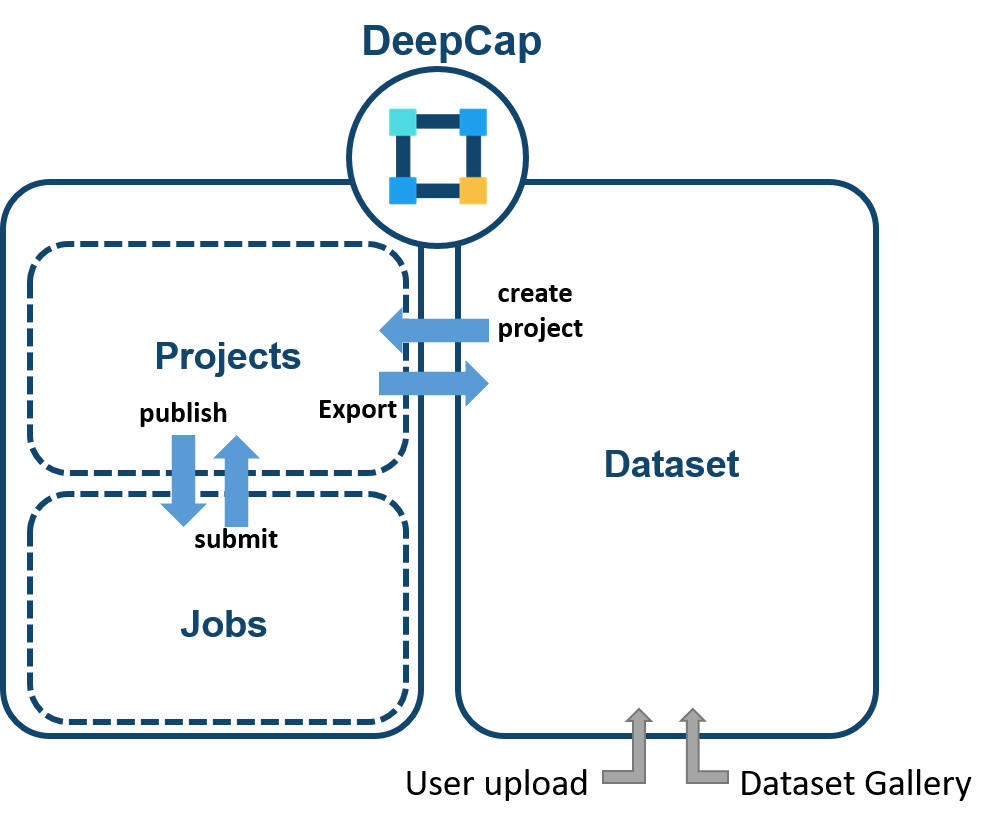

# 👨‍🏫 Create & Run Annotation Project

DeepCap is an annotation tool with a project-based workflow and a simple interface. You can create a new annotation project by completing the following steps: configure project settings, select dataset & define labels and add project members.

<figure><figcaption></figcaption></figure>
