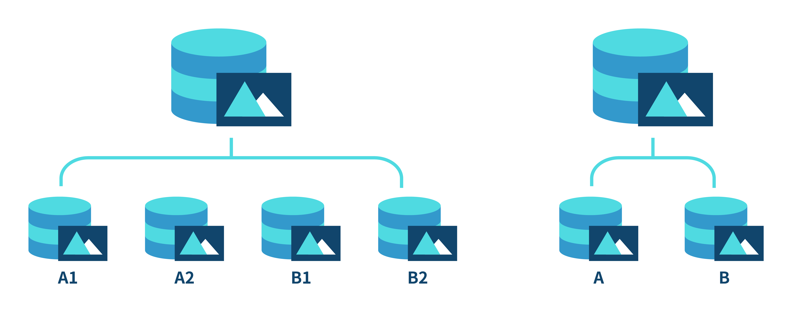
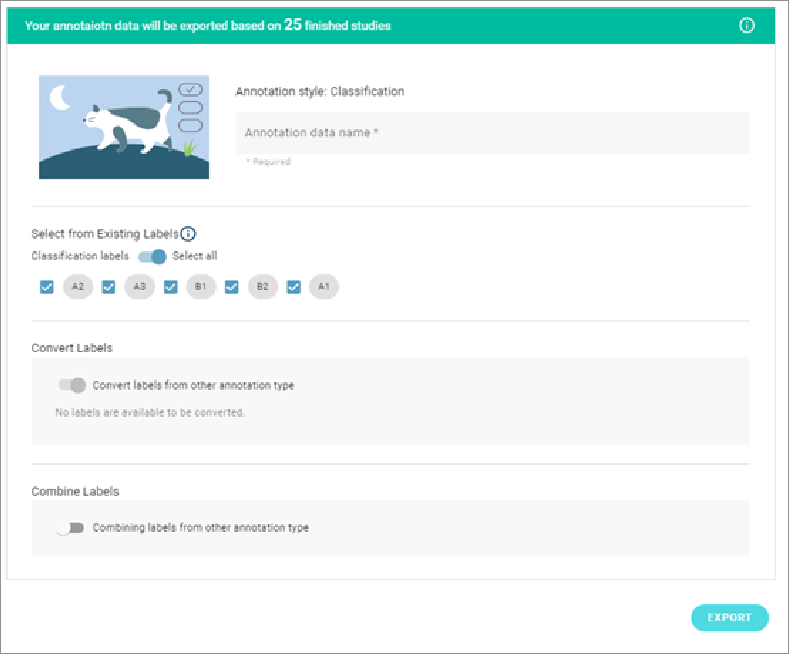
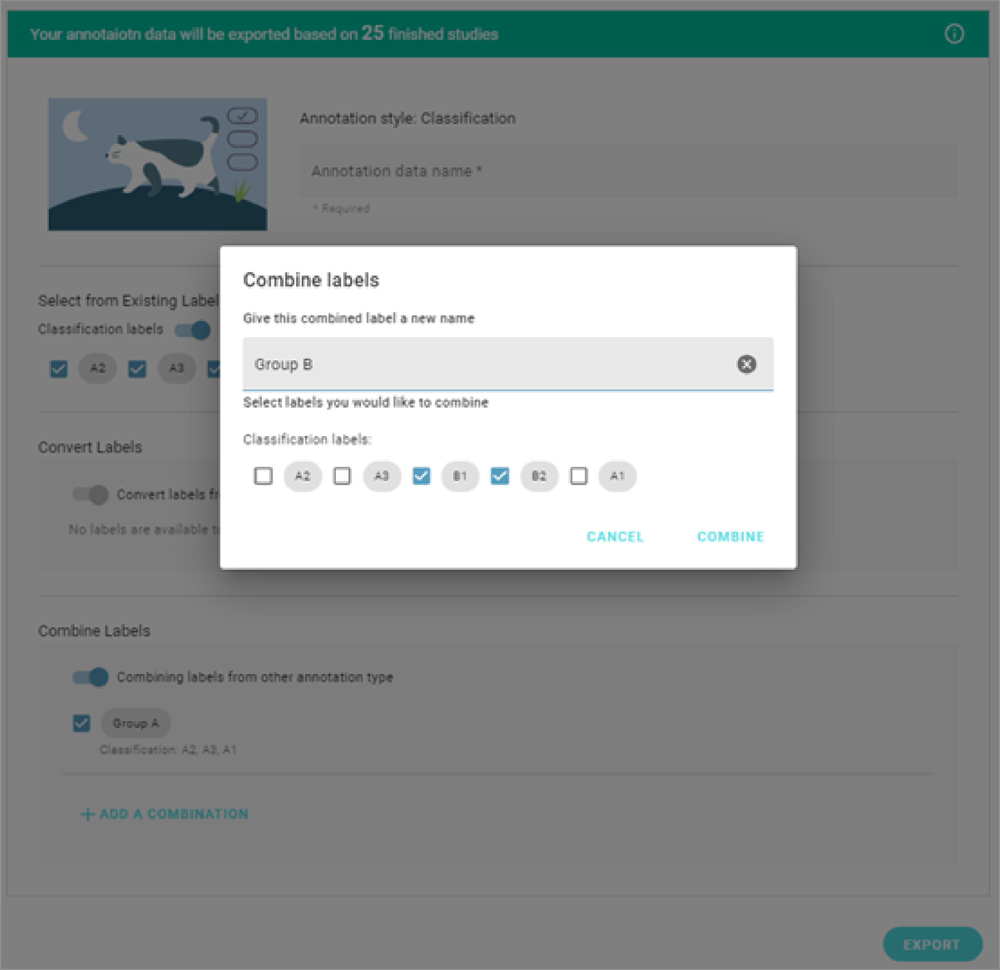
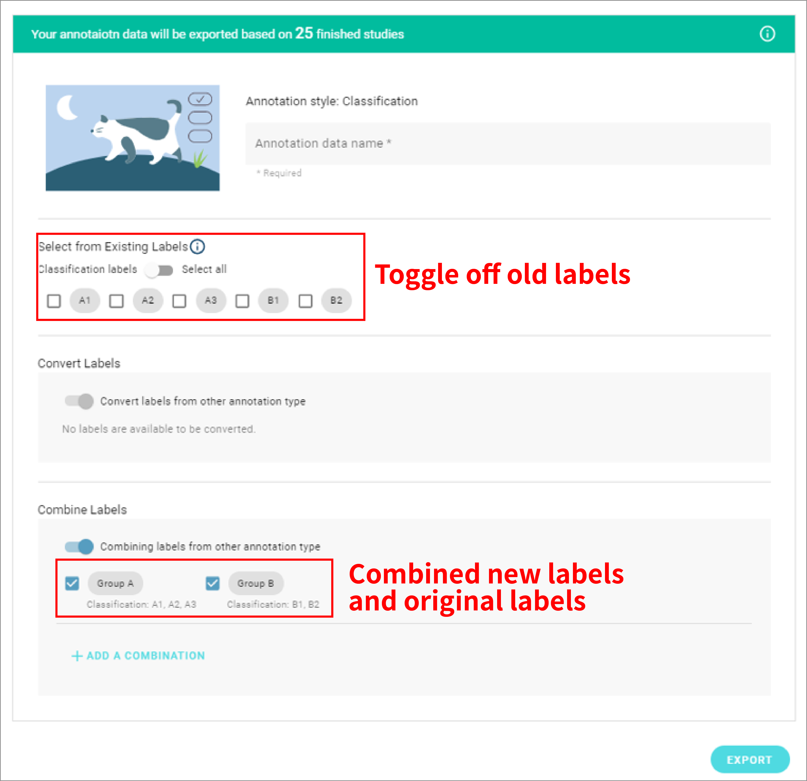
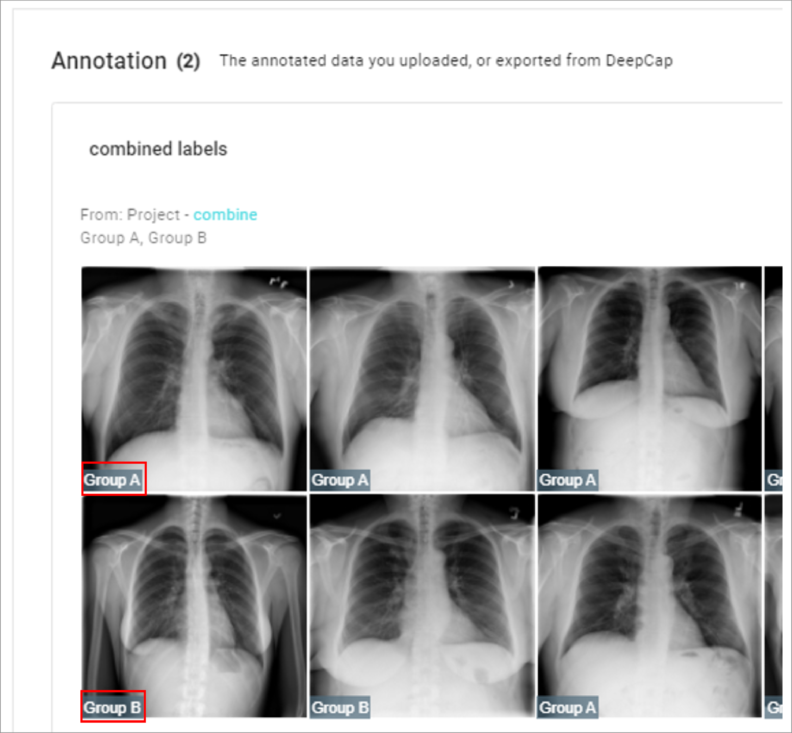
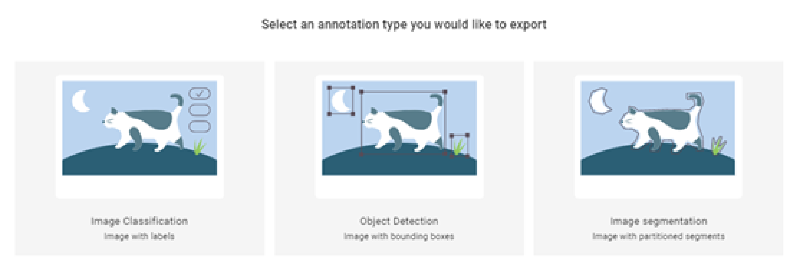
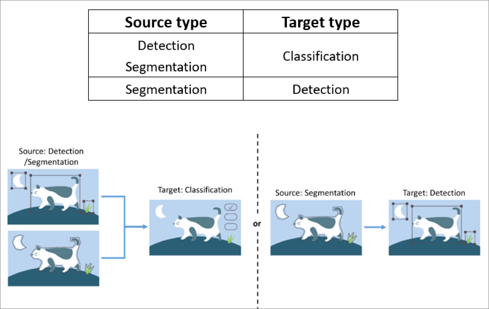
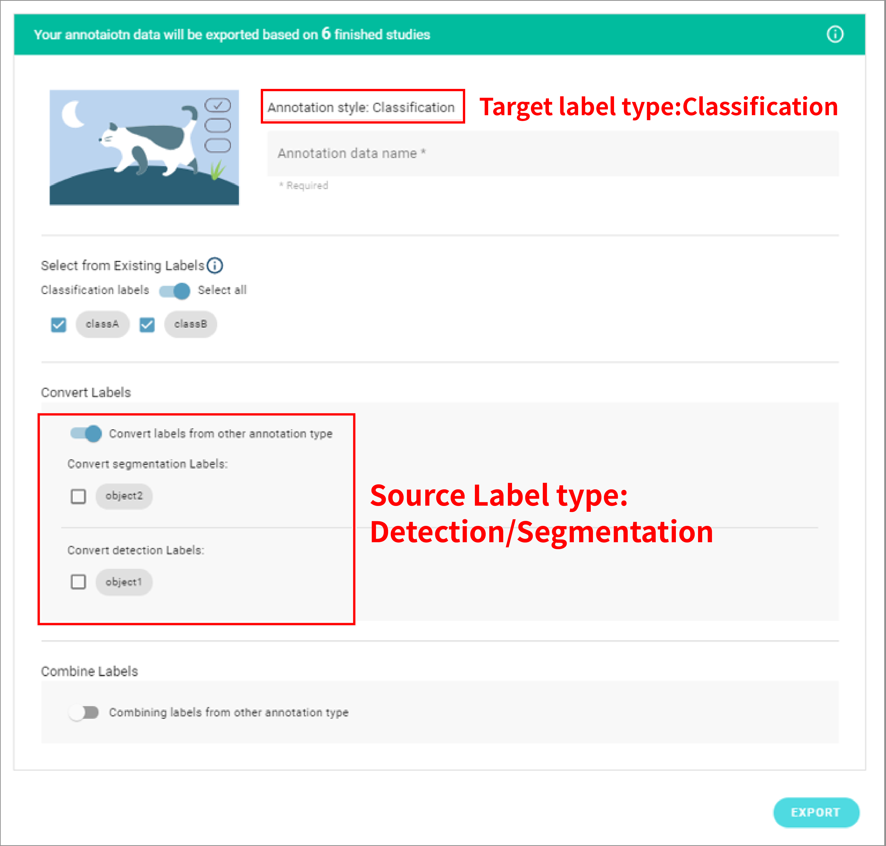
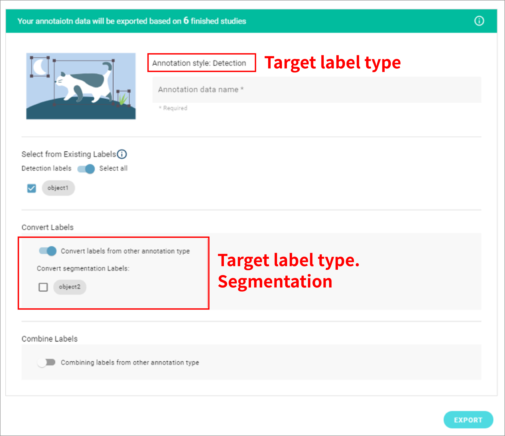

# Advanced Tips

### Combine labels 

In image classification tasks, although the idea of training a single algorithm to identify numerous classes is appealing, splitting training data among these classes might result in less data per class and eventually causing the neural network unable to learn from the data successfully, thus poor performance.

Splitting data among more classes causes less data per class, reducing the effective data size for the neural network to learn from.

During annotation project export, user can choose to export directly from the labels or to combine labels into new ones.

Click “add a combination” after toggling on the combine label function. User may choose how to combine the classes and assign new class names.

After combining labels, remember to toggle off the existing labels to prevent the new label to become a multi-label annotation (A single image belongs more than one class, “A1” & “Group A” in this case).

The combined labels will appear in the new annotation data.

### **Convert labels** 

It happens when a user wants to train a classification AI with object detection annotation data. In order to do so, the labels have to be converted into classification for the algorithms to learn from. DeepQ AI platform provides an easy way for users to convert their label type and try out different applications with the same annotation data.

During export annotation, choose the annotation type (target) you want, DeepQ AI platform will automatically find out & show the available labels (source) to convert from. The target-source conversion table is listed below.

Both detection (object 1) & segmentation (object 2) labels can be converted into classification labels. The new classification label will be names as “object 1” & “object 2”

Only segmentation labels (object 2) can be converted into detection labels, the label name and number of objects will remain the same after conversion.
