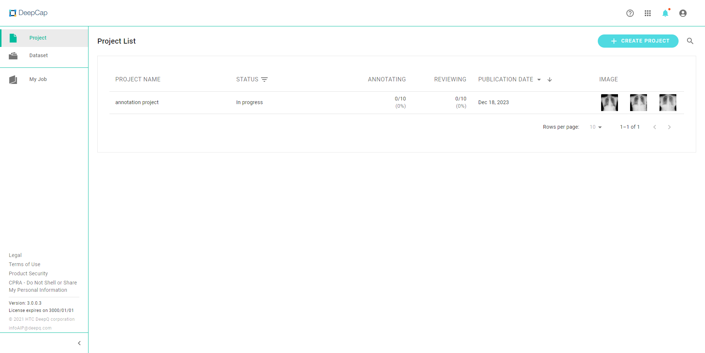
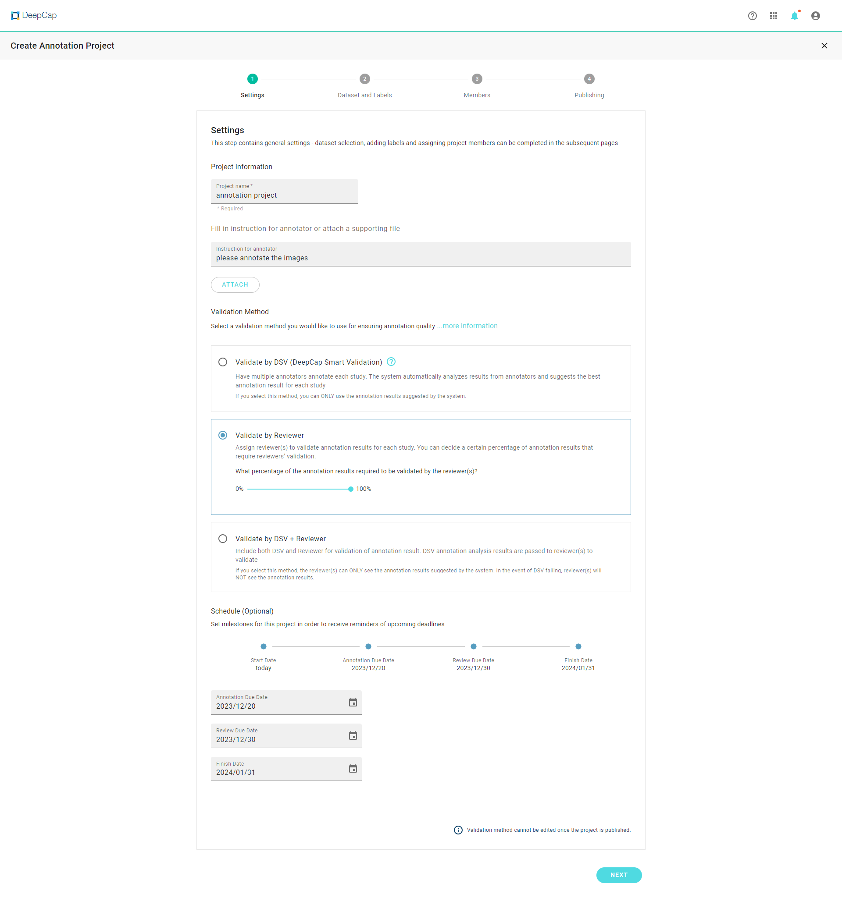
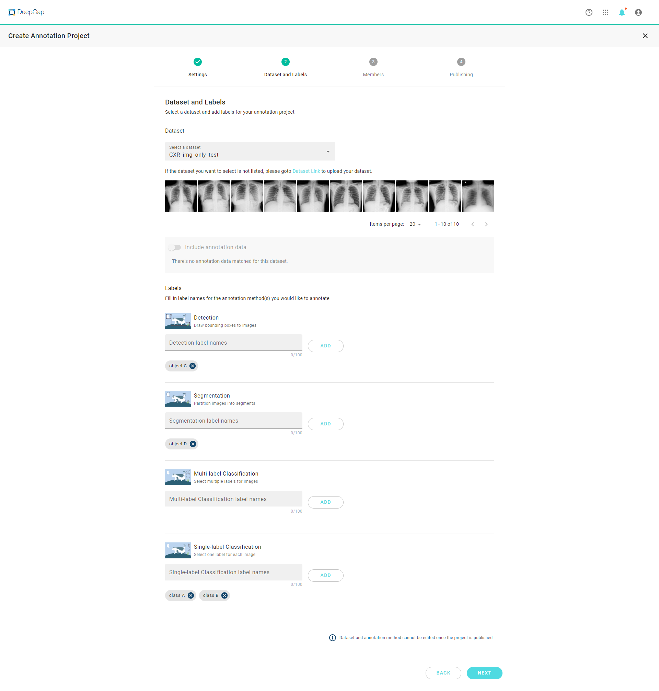
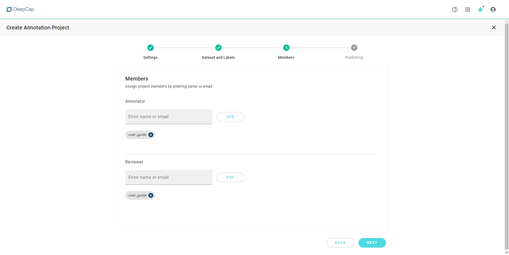
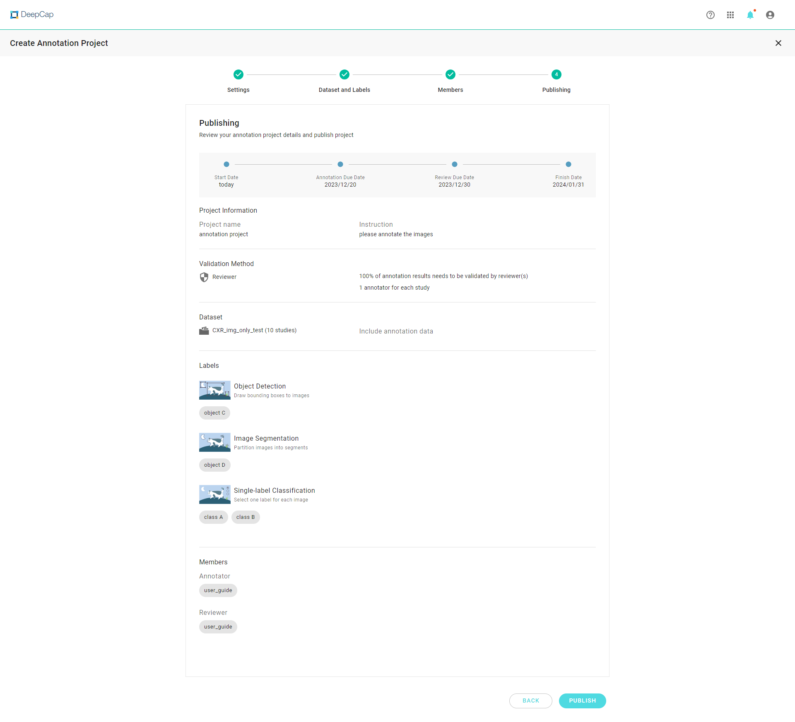

# Create Annotation Project

Start creating a new annotation project by clicking on "**CREATE PROJECT**".&#x20;

<figure><figcaption></figcaption></figure>

#### You will enter a 4-step setup process to create and publish an annotation project.&#x20;

### 1. Settings 

<figure><figcaption></figcaption></figure>

### **Input project name and related instruction.**

* Other than written instructions, project owner can attach additional reference files (jpg, png & pdf)

### **Select validation method：**

* Choose one of the validation method from the below options. For the detailed explanation of DSV & reviewer, please refer to [Annotation Quality Control](https://console.deepq.ai/docs/console/working-flow/create-an-annotation-project/1.-settings/deepcap-smart-validation-dsv.html).

### **Schedule the project progress (optional).**

## 2. Dataset & Labels 

<figure><figcaption></figcaption></figure>

### Select Dataset 

* Select one of the datasets that have been uploaded from the drop list.
* Case preview will be shown below to help you ensure that you select the correct dataset.
* You can choose to include the annotation data.

### Label Setting 

* Chose one or more label types that you want to add on the dataset.
* Define the label names for each label type.

### Task definition 

* **Single-Label Image Classification:** Only one label can be marked on a case.
* **Multi-Label Image Classification:** multiple labels can be marked on a case.
* **Object Detection:** Use bounding box to detect and identify target objects.
* **Object Segmentation:** To segment and define the ROI (region of interest).

## 3. Members 

<figure><figcaption></figcaption></figure>

### Assign Annotators/Reviewers 

Only users who have already registered on this platform can be invited as annotator/reviewer. Each annotator can be removed after selection.

## 4. Publishing 

<figure><figcaption></figcaption></figure>

### Publish Project 

The final step before publishing an annotation project is to review the settings.

The annotation project can be published once the settings are correct. All the participated annotators would receive an invitation mail, and the annotation process is initiated.
