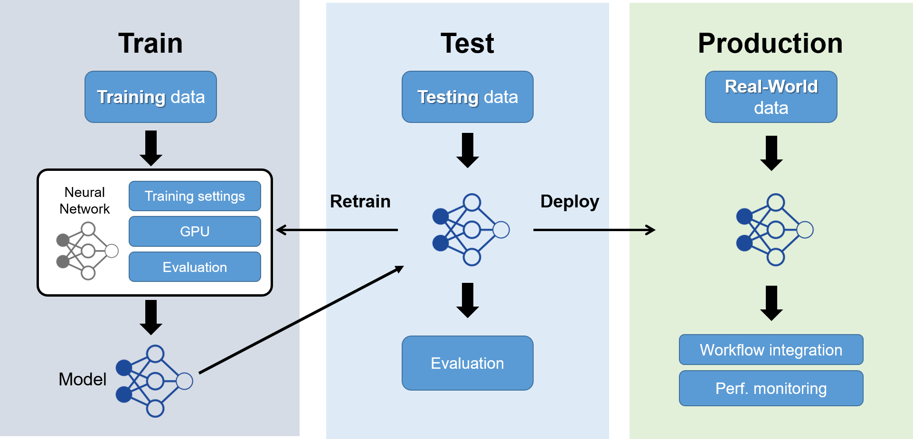

# 👨🔬 Train/Test AI Model

### Deep Learning Pipeline 

In the realm of deep learning, the process unfolds in distinct phases: **training**, **testing**, and **production**. During the training phase, the model learns from labeled data, adjusting its parameters to make accurate predictions. Subsequently, the model is subjected to the testing phase, where its performance is evaluated on unseen data to ensure generalization. Finally, in the production phase, the trained and tested model is deployed for real-world applications, making predictions on new, unseen data. Each phase plays a crucial role in developing robust and effective deep learning models for a variety of practical use cases.

<figure><figcaption></figcaption></figure>

### The 3 phases explained with a dog/cat image classifier:

### 1. Training Phase

* **Training:** During this phase, the computer is shown lots of labeled pictures of dogs and cats. It learns to recognize patterns—like shapes, fur textures, and colors—associated with each animal.
* **Adjusting Parameters:** The model adjusts its internal settings (parameters) based on these examples to get better at telling dogs apart from cats. It learns the differences between the two animals.

### 2. Testing Phase

Model training represents only half of the equation; the real challenge lies in testing it with real-world data. Deploy your models and generate inference results by running them on data with ground truth, yielding objective outcomes for further analysis.

* **Testing:** Once the model has learned from the training data, it's tested with new, unseen pictures of dogs and cats that it hasn't studied before.
* **Assessing Accuracy:** The model tries to classify these new images as either dogs or cats. The accuracy is measured by how many it gets right. For example, if it correctly identifies 9 out of 10 new images, it's 90% accurate.

### 3. Production Phase

* **Real-world Application:** In the production phase, the trained model is deployed for practical use. It's like using the trained model in a pet adoption center to identify animals in incoming pictures.
* **Practical Use:** When a new picture of an animal arrives, the model uses what it's learned from training to decide if it's a dog or a cat. It's essentially using its knowledge to perform the task it was trained for.

\
\

\
