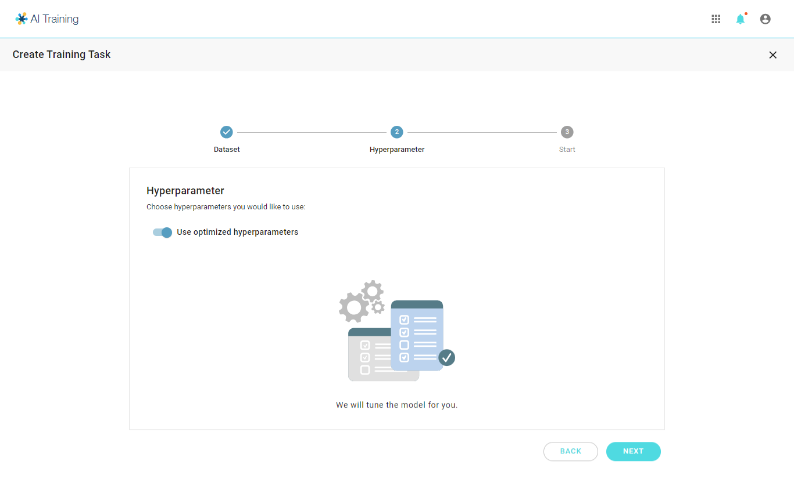

# Existing Model Retraining

#### &#x20;

### Select Existing Model to retrain

Select one of your previously trained models to start a new training task

<figure><figcaption></figcaption></figure>

***

## Select Dataset 

* All training tasks requires the user to select one of the datasets from the drop list.
* Only datasets with annotation corresponding to your selected type will be shown in the list.
* Case preview will be shown below to help you ensure that you select the correct dataset.

***

### Model Tuning

### Auto Tuning (Default)

<figure><figcaption></figcaption></figure>

### Manual Tuning

<figure><figcaption></figcaption></figure>

### Confirm & start task
