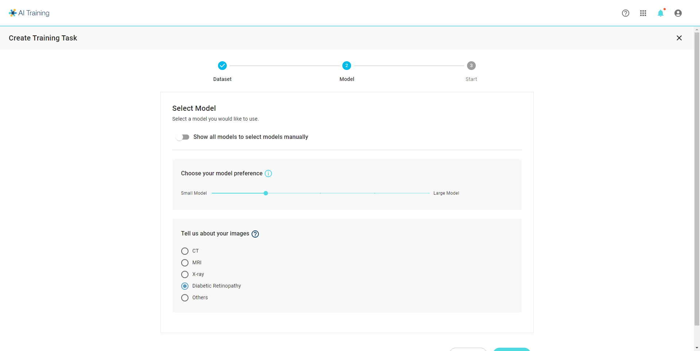

# General Training

### General Training 

The first step of general training is to select the task type: image classification, object detection or Object segmentation

## Select Dataset 

* All training tasks requires the user to select one of the datasets from the drop list.
* Only datasets with annoatation corresponding to your selected type will be shown in the list.
* Case preview will be shown below to help you ensure that you select the correct dataset.

## Select Model & Tuning methods 

### Auto Select: 

* Input your data type & training preference for us to suggest a neural network that meets you needs.
* The options for data type & training preference will not appear in "Specialized Training" & "Existing Model Retraining"

<figure><figcaption></figcaption></figure>

### Manually Select: 

* There are over 200 neural netwok \* pre-train combinations in the DeepQ AI Training model zoo that utilizes [transfer learning](https://console.deepq.ai/docs/console/working-flow-1/what-is-deep-learning.html#what-is-transfer-learning) for faster & better training results.
* Expand model list to select the model variation you want to use.
* Neural Network in "Specialized Training" & "Existing Model Retraining" are pre-determined.
* For more manual tuning options, please refer to [Model Training & Hyperparameter tuning explained](https://console.deepq.ai/docs/console/account-management/model-training-and-hyperparameter-tuning-explained.html)

## Start Training Task 

* Name the task and add task description (optional), press start to complete the creating process.

