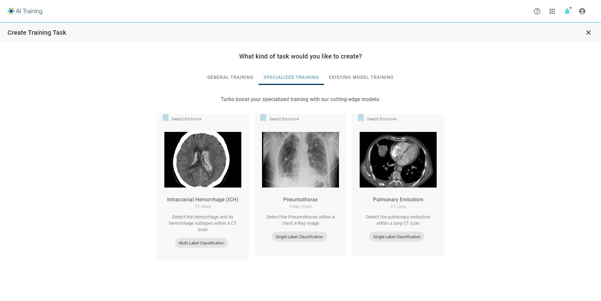
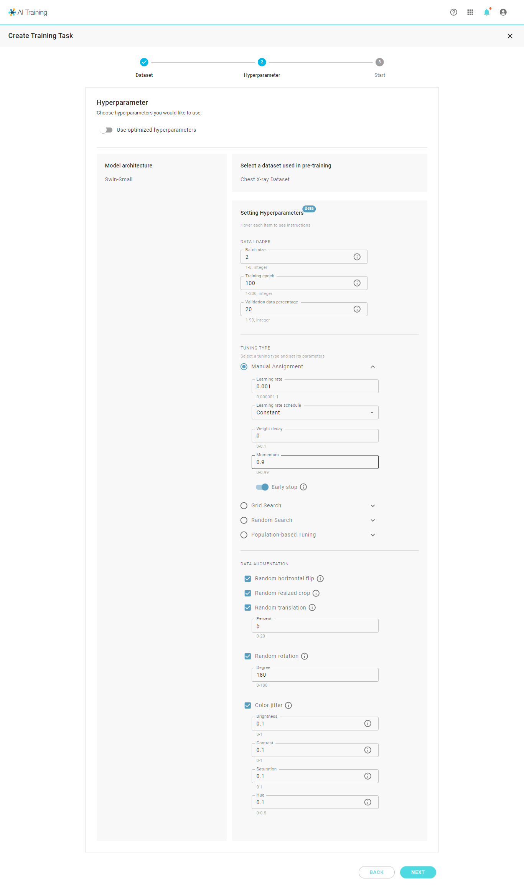
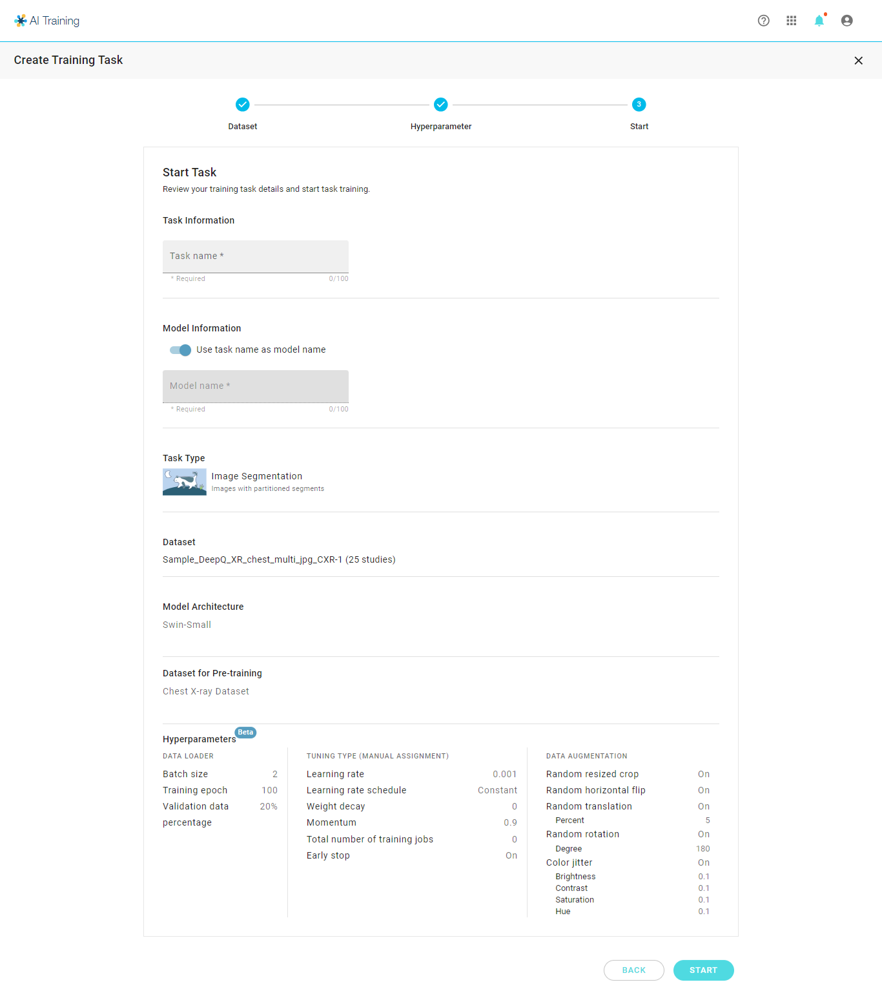

# Specialized Training

### Specialized Training 

With specialized training, you may choose from the tasks that has been prepared by DeepQ. Users should provide datasets (image format & annotation) according to the table below.

***

### Select Application

<figure><figcaption></figcaption></figure>

| Topics                      | Task type                       | Image format              | Classes                                                                                                                                      |
| --------------------------- | ------------------------------- | ------------------------- | -------------------------------------------------------------------------------------------------------------------------------------------- |
| **Intracranial Hemmorhage** | Multi-Label Classification (5)  | Head CT , non-contrast    | 
>Subarachnoid hemorrhage >Subdural hemorrhage >Epidural hemorrhage >Intraparenchymal hemorrhage >Intraventricular hemorrhage
 |
| **Pneumothorax**            | Single Label Classification (2) | Chest X-ray               | 
>PTX >normal
                                                                                                                       |
| **Pulmonary Embolism**      | Single Label Classification (2) | Chest CT with contrast IV | 
>PE >normal
                                                                                                                        |

***

## Select Dataset 

* All training tasks requires the user to select one of the datasets from the drop list.
* Only datasets with annotation corresponding to your selected type will be shown in the list.
* Case preview will be shown below to help you ensure that you select the correct dataset.

***

### Model Tuning

#### Auto Tuning (Default)

<figure><figcaption></figcaption></figure>

#### Manual Tuning

<figure><figcaption></figcaption></figure>

#### Confirm & start task

<figure><figcaption></figcaption></figure>
