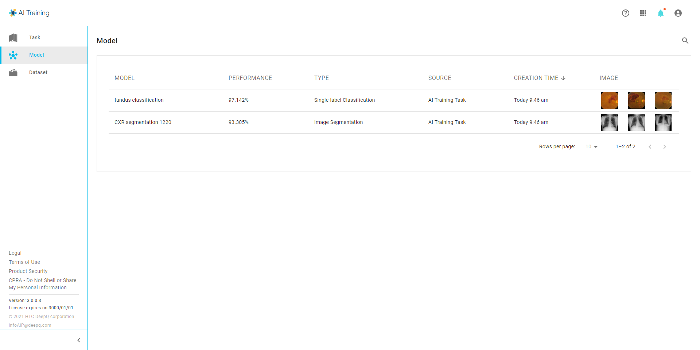

# View/Test Models

### Model Overview 

<figure><figcaption></figcaption></figure>

### Model Detail

<figure><figcaption></figcaption></figure>

<figure><figcaption></figcaption></figure>

<figure><figcaption></figcaption></figure>

<figure><figcaption></figcaption></figure>

### Deploy Model & Inference 

* You have to deploy the model before creating any inference task.

* There are two modes of model inference: batch & real-time.

#### Real-time inference 

* **Real-time inference:** Select and open one JPG/ PNG image from your local device, the inference result will be shown automatically .

#### Batch inference 

* **Batch inference:** Select one of the dataset that you have uploaded from the drop list, enter the inference name and complete the creation process.
  * Prediction only: For datasets without annotation data, inference result will only provide prediction results without an inference report.

### View Inference 

#### Annotation Data (with ground truth/label) 

* The inference detail, including training task, dataset, and annotation data will be shown here.
* Inference List: You can view the inference detail about the dataset, accuracy, and status.
* Inference Dataset shows all the cases that have been trained in this task.

* The detailed performance of each inference job is summarized in the Inference Report.\ <mark style="color:yellow;">**For more information, please see the following sections:**</mark>\ [https://console.deepq.ai/docs/console/account-management/4.7-ai-insight/4.7.2-inference-report.html](https://console.deepq.ai/docs/console/account-management/4.7-ai-insight/4.7.2-inference-report.html "mention")\ [https://console.deepq.ai/docs/console/account-management/deep-learning-metrics-explained](https://console.deepq.ai/docs/console/account-management/deep-learning-metrics-explained "mention")

<figure><figcaption></figcaption></figure>

#### Prediction only 

* Each image of the selected dataset will be shown in the last column, you can check the result by clicking on the image.

