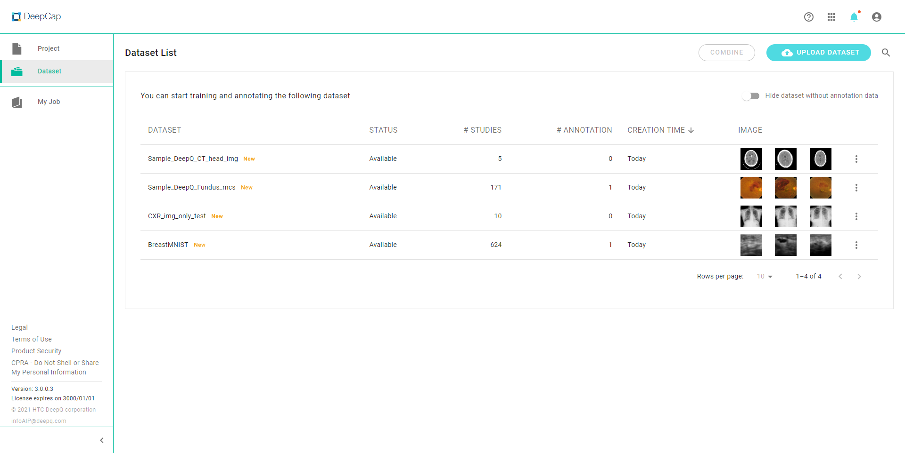
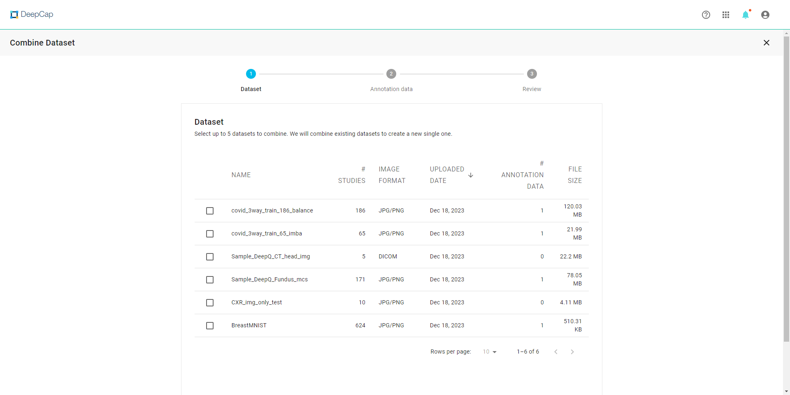

# Combine Datasets

* Users can create new datasets by combining existing datasets.
* Click on the "**COMBINE**" tab at the upper right corner of the Dataset list

<figure><figcaption>
Select "Combine" at the upper right corner to start combining datasets
</figcaption></figure>

#### Rules of Dataset combination 

* If all source datasets are images, the combined result will consist only images.
* A new label will be created in the combined result if **at least one label** is selected from source datasets.
* Only **the same type** (classification, detection, segmentation) of labels can be combined.
* Dicom images will be converted to png format if the combination involves mixed image formats.

## Select Datasets 

First step requires the user to choose source datasets.

<figure><figcaption>
Step #1 of combine dataset shows the list of all uploaded datasets, with or without annotation
</figcaption></figure>

<figure><figcaption>
Select more than one datasets to combine
</figcaption></figure>

## Select Annotation Types 

<figure><figcaption>
The system will list all the labels of the selected type from each source dataset for the user to select.
</figcaption></figure>

## Review & Combine 

<figure><figcaption>
The last step requires the user to review the combination setting and name the combined dataset.
</figcaption></figure>

<figure><figcaption>
Once the combination is successfully processed, the result can be viewed and managed in the dataset list
</figcaption></figure>
