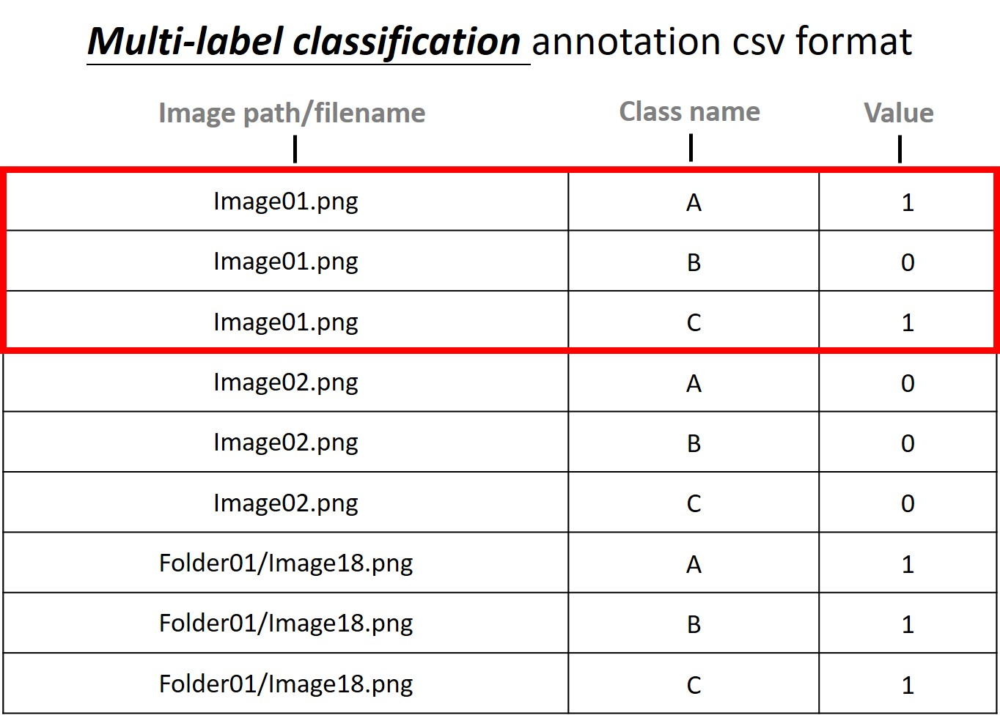
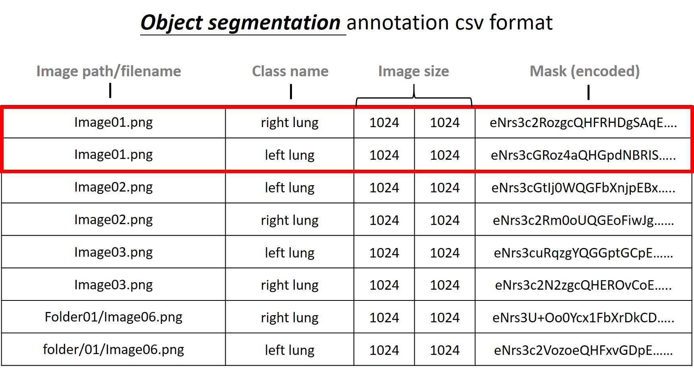

# Data Formats

DeepQ AI Platform supports differnt types of labeld data such as classification, detection & segmentation. If a user has labels created by other annotation tools, just convert them into the formats described below then upload to the DeepQ AI platform. Once the dataset is accepted by the platform, you can train your models right away.

***

### Dataset Format 

The accepted dataset format is described below, please check your dataset and image format before uploading.

### Dataset format: zip file 

* **Image only:** Images (jpg, png & Dicom) can be placed anywhere in the .zip file.
* **With annotation:** To upload images with annotation, “**label.csv**” should be presented here.
* **For annotation file (label.csv) format, please refer to** [**Annotation Data Formats**](https://console.deepq.ai/docs/console/dataset/annotation-data-formats.html) _\*\*_

### Import multi-class data from separate folders 

Images can also be stored in different folders under "Classes" then upload the compressed zip file. By doing so, the DeepQ AI Platform will automatically label the images according to the folder name, e.g. "Class A", and no additional annotation effort will be needed.

### Image Classification (Single-Label): 

* Each row specifies the path/filename and class, separated by a comma in between.
* The pairs of an image name and a category label start from the first line. That is, there is no CSV header in the label file.

### Image Classification (Multi-Label): 

<figure><figcaption></figcaption></figure>

* Each row specifies the path/filename, class and value, all separated by commas in between.
* The pairs of an image name and a category label start from the first line. That is, there is no CSV header in the label file.
* Images that contains only path/filename will be used in training, in contrast to image that are not listed in the csv (excluded from training).&#x20;

### Object Detection: 

* Each row specifies a bounding box of an object.
* Each row must include 6 fields, separated by a comma: image name, object name, xLeft, yTop, width, height.
* (xLeft, yTop) is the top-left vertex of the bounding box, and width and height indicate the width and height of the bounding box.
* (x, y, w, h) can be either integer or floating-point numbers.
* If an image contain more than 1 bounding boxes, it can be shown in multiple rows.
* Images that contains only path/filename will be used in training, in contrast to image that are not listed in the csv (excluded from training).&#x20;

### Object Segmentation: 

<figure><figcaption></figcaption></figure>

* Each row specifies a bounding box of an object.
* Each row must include 5 fields, separated by a comma: image path/name, class name, image size (x\&y) & mask.
* All objects of the same class will be represented by a single mask.
* Images that contains only path/filename will be used in training, in contrast to image that are not listed in the csv (excluded from training).&#x20;
* DeepQ AI platform uses a proprietary format for depicting masks that offers better flexibility in label modification and storage efficiency. If you want to export your segmentation label as a specific format, please contact DeepQ for assistance.

