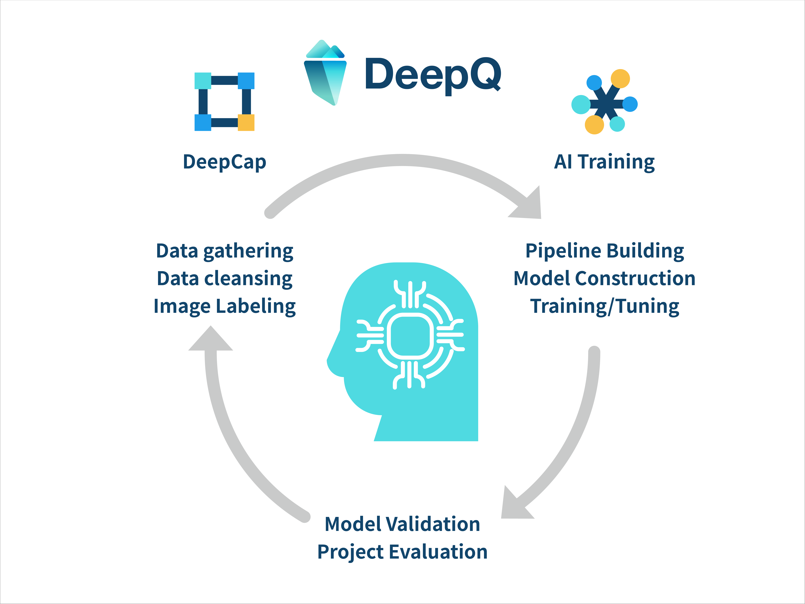

# DeepQ AI Platform overview

## DeepQ AI Platform provide one-stop software products from medical data annotation to AI model training via web browser.

 (2).png>)

## **DeepCap (Annotation tool)**

* De-identification & anonymize of the imported medical image data.
* To produce labeled data using annotation tools (classification, detection & segmentation).
* To create, manage & monitor annotation projects and to ensure the quality of labeled data.
* To import labeled data from other sources.

## **AI training**

* Provide various AI models for training.
* To create**,** manage & monitor AI training tasks.
* Automatic hyper-parameter tuning for minimal IT manpower.
* Provide metrics to evaluate the training progress & outcome of the models.

## **Model deployment**

* Produce qualitative inference results.
* Graphical interpretation of model performance & provide insight.
* GPU scheduling & intelligent queuing of training tasks.

DeepQ AI Platform dramatically reduces the learning thresholds and the cost of AI model training through efficient image annotation tools, optimized training environment, built-in multiple AI models, fully automated parameter tuning, and a simple user interface. It is different from the existing AI training platforms and services available on the market, users of DeepQ AI Platform can quickly convert their own medical image data into the AI models without the knowledge and skills of deep learning.
