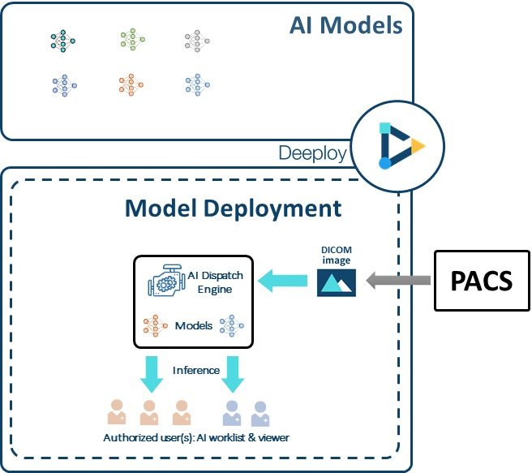

# 1.1 Deeploy overview

Deeploy is where your models run on real world data, and provides the inference result to autorized users via AI worklist & viewer. The complete list of Deeploy's features are listed below：

* Multiple AI models up and running with real-world data received via standard DICOM standard protocols
* Smart dispatch sends images to different AI deployments according to query rules set by users
* Configurable AI worklist items and AI indicators to enhance efficiency
* Deployment authorization. Different users for different model deployments
* Provide statistics for each deployment for performance monitoring
* Download inference history for futher analysis and model retrain.

<figure><figcaption></figcaption></figure>

