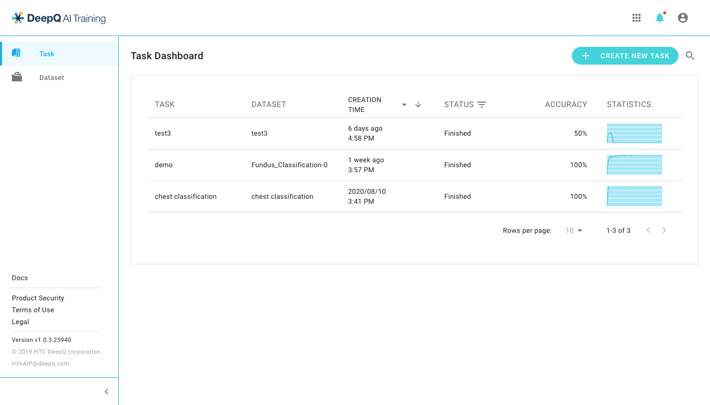

# DeepQ AI Platform overview

## Platform overview

## DeepCap Overview

### Side Menu

**Project**: Person who create a project will be the project owner. The project owner can check and manage all the projects in this tab.

**Dataset**: You can upload datasets in this tab.The system has imposes some limitations on your dataset, please refer to the [“Dataset Format”](https://app.gitbook.com/@deepq/s/aip/dataset/upload-dataset) and[ "Annotation Data Format"](https://app.gitbook.com/@deepq/s/aip/dataset/annotation-data-formats) tab for detailed information.

**My Job**: Annotators/Reviewers can view and work on the jobs assigned to them by a project owner.

## AI Training Overview

\*\*\*\*

  
​

‌

## Side Menu 

‌

**Task**: Person who create a task will be the project owner. The project owner can check and manage all the tasks in this tab.‌

**Dataset**: You can upload datasets in this tab.The system has imposes some limitations on your dataset, please refer to the [“Dataset Format”](https://app.gitbook.com/@deepq/s/aip/dataset/upload-dataset) and ["Annotation Data Format"](https://app.gitbook.com/@deepq/s/aip/dataset/annotation-data-formats) tab for detailed information.

### 

