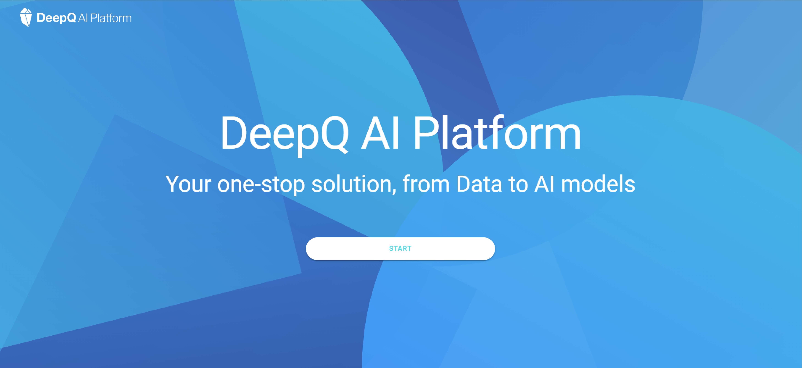
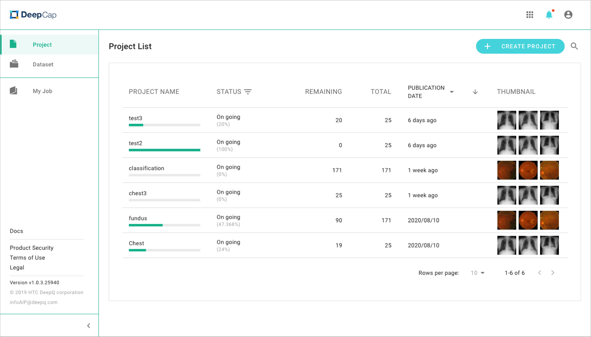
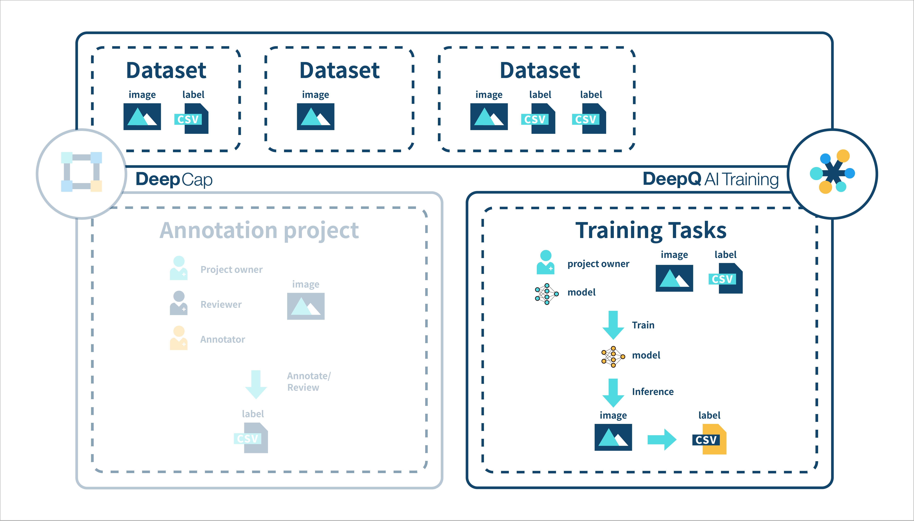
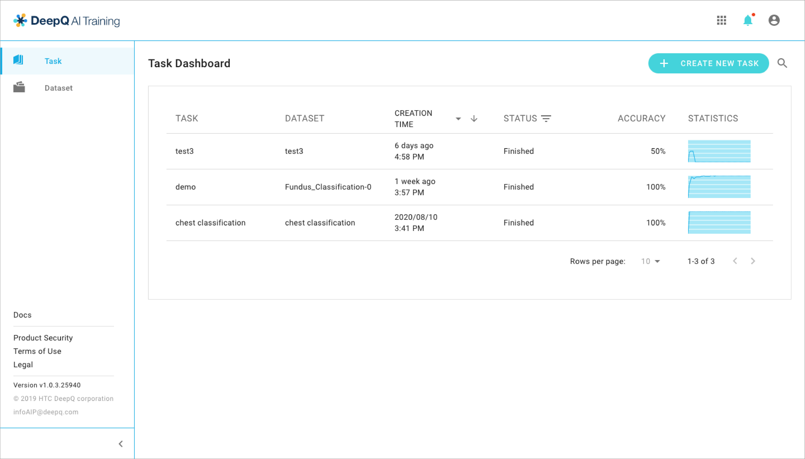

# 1.2 DeepQ AI Platform overview

.png>)

.png>)

## Platform overview

The complete DeepQ AI Platform consists of three main modules：

* DeepCap：
* AI Training：
* Deeploy：&#x20;

 (2).png>)

## DeepCap Overview

### Side Menu

**Project**: Person who create a project will be the project owner. The project owner can check and manage all the projects in this tab.

**Dataset**: You can upload datasets in this tab.The system has imposes some limitations on your dataset, please refer to the [“Dataset Format”](https://app.gitbook.com/s/-LRpbrznmSNshCiwmSTG-3251841457/dataset/upload-dataset) and[ "Annotation Data Format"](https://app.gitbook.com/s/-LRpbrznmSNshCiwmSTG-3251841457/dataset/annotation-data-formats) tab for detailed information.

**My Job**: Annotators/Reviewers can view and work on the jobs assigned to them by a project owner.

## AI Training Overview

​

## Side Menu 

‌

**Task**: Person who create a task will be the project owner. The project owner can check and manage all the tasks in this tab.‌

**Dataset**: You can upload datasets in this tab.The system has imposes some limitations on your dataset, please refer to the [“Dataset Format”](https://app.gitbook.com/s/-LRpbrznmSNshCiwmSTG-3251841457/dataset/upload-dataset) and ["Annotation Data Format"](https://app.gitbook.com/s/-LRpbrznmSNshCiwmSTG-3251841457/dataset/annotation-data-formats) tab for detailed information.

## Deeploy Overview

 (1).png>)

.png>)

## Side Menu 

‌

**Worklist**: Person who create a task will be the project owner. The project owner can check and manage all the tasks in this tab.‌

**Authorized Models**: You can upload datasets in this tab.The system has imposes some limitations on your dataset, please refer to the [“Dataset Format”](https://app.gitbook.com/s/-LRpbrznmSNshCiwmSTG-3251841457/dataset/upload-dataset) and ["Annotation Data Format"](https://app.gitbook.com/s/-LRpbrznmSNshCiwmSTG-3251841457/dataset/annotation-data-formats) tab for detailed information

