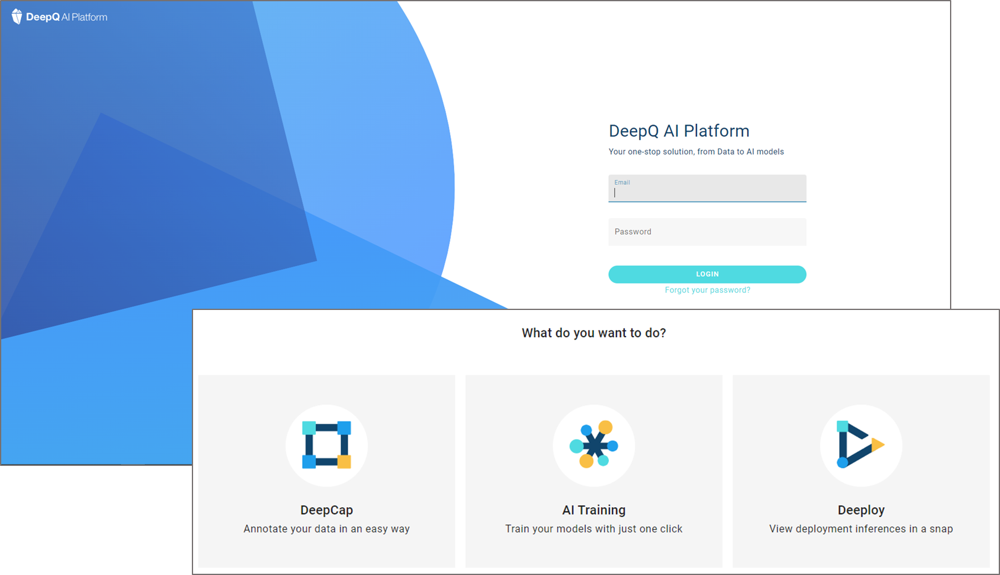
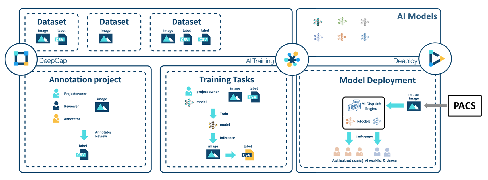
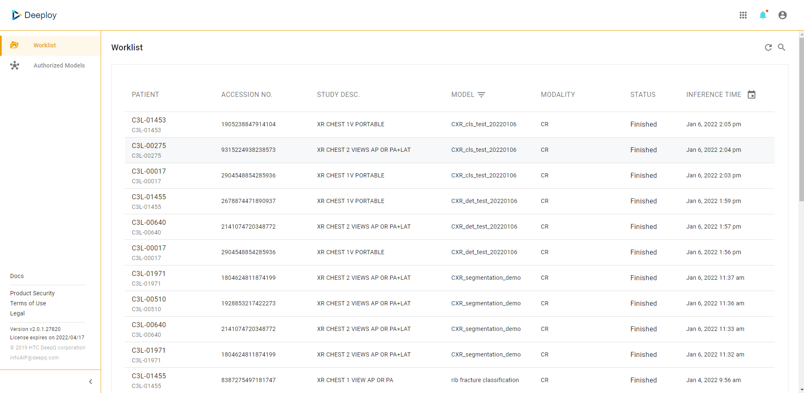

# 1.2 DeepQ AI Platform overview

The moment you log into DeepQ AI Platform, you can choose from the three modules to start from. Please contact the system admin for your module authorization.

## Platform modules overview

The complete DeepQ AI Platform consists of three main modules：

* \*\*DeepCap：\*\*Dataset management & image annotation
* \*\*AI Training：\*\*Model selection/tuning & evaluation
* \*\*Deeploy：\*\*Real-time model deployment, worklist & AI viewer

## Deeploy Overview

Deeploy is where your models run on real world data, and provides the inference result to autorized users via AI worklist & viewer.

### Side Menu 

<mark style="color:yellow;">**Worklist**</mark><mark style="color:yellow;">: A complete list of the image studies processed by model deployments that are authorized to you, shown from newest to oldest. Users can filter the worklist by selecting models by clicking on "</mark><mark style="color:yellow;">**MODEL**</mark><mark style="color:yellow;">".</mark>

<mark style="color:yellow;">**Authorized Models**</mark><mark style="color:yellow;">: You can view the detials of model deployments that are authorized to you. please conatct system admin for model deployment authorization.</mark>
