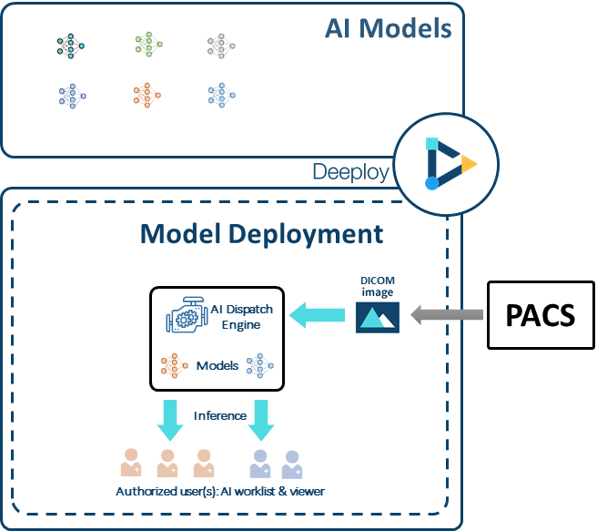

# 1.2 DeepQ AI Platform overview

The moment you log into DeepQ AI Platform, you can choose from the three modules to start from. Please contact the system admin for your module authorization.

 (1).png>)

## Platform modules overview

The complete DeepQ AI Platform consists of three main modules：

* DeepCap：Dataset management & image annotation
* AI Training：Model selection/tuning & evaluation
* Deeploy：Real-time model deployment, worklist & AI viewer&#x20;

 (1) (1) (1) (1).png>)

## DeepCap Overview

DeepCap is where you can create, manage or join an annotation project

### Side Menu

**Project**: Person who create a project will be the project owner. The project owner can check and manage all the projects in this tab.

**Dataset**: You can upload datasets in this tab.The system has imposes some limitations on your dataset, please refer to the [“Dataset Format”](https://app.gitbook.com/s/-LRpbrznmSNshCiwmSTG-3251841457/dataset/upload-dataset) and[ "Annotation Data Format"](https://app.gitbook.com/s/-LRpbrznmSNshCiwmSTG-3251841457/dataset/annotation-data-formats) tab for detailed information.

**My Job**: Annotators/Reviewers can view and work on the jobs assigned to them by a project owner.

## AI Training Overview

AI Training allolws users to train & test their AI models with no coding expertise

​

### Side Menu 

‌**Task**: Person who create a task will be the project owner. The project owner can check and manage all the tasks in this tab.‌

**Dataset**: You can upload datasets in this tab.The system has imposes some limitations on your dataset, please refer to the [“Dataset Format”](https://app.gitbook.com/s/-LRpbrznmSNshCiwmSTG-3251841457/dataset/upload-dataset) and ["Annotation Data Format"](https://app.gitbook.com/s/-LRpbrznmSNshCiwmSTG-3251841457/dataset/annotation-data-formats) tab for detailed information.

## Deeploy Overview

Deeploy is where your models run on real world data, and provides the inference result to autorized users via AI worklist & viewer.

 (1).png>)

### Side Menu 

**Worklist**: A complete list of the image studies processed by model deployments that are authorized to you, shown from newest to oldest. Users can filter the worklist by selecting models by clicking on "MODEL".

**Authorized Models**: You can view the detials of model deployments that are authorized to you. please conatct system admin for model deployment authorization.
