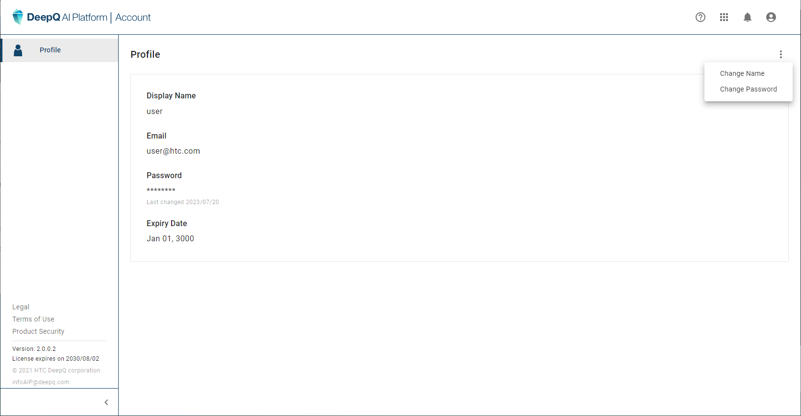

# 1.2 User profile & account management

### **Manage user profile ： Change user name \&Password**

* Click on the account button, and select "view my profile" link.
* Click on the top right tab “  ” to change user name / password.

