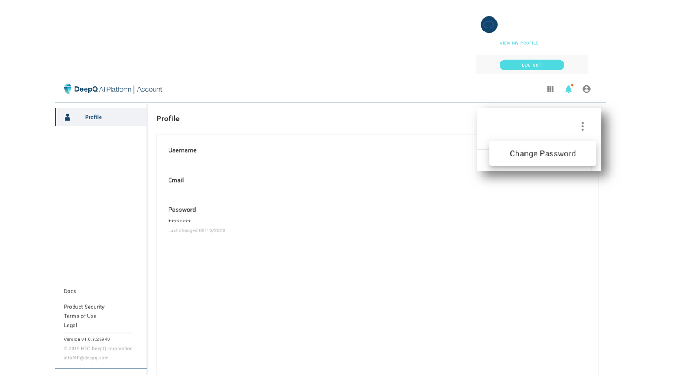

# 1.3 User roles & Account Management

## Three roles in DeepQ AI Platform

* **Project Owner:** The owner of an annotation project & training task. He/ She can upload, create and manage datasets, annotation projects, and training tasks.
* **Reviewer:** Assigned by the project owner to review the labeling results pass down by annotators.
* **Annotator:** Assigned by the project owner to annotate the data. 

| Function/ roles | Project owner | Reviewer | Annotator |
| :---: | :---: | :---: | :---: |
| Upload/ manage dataset | V |  |  |
| Create & publish annotation project | V |  |  |
| Review annotation | V | V |  |
| Join annotation job | V | V | V |
| Create/ manage AI Training task | V |  |  |
| Create AI inference/ view results | V |  |  |

## **Manage user profile / Change Password**

* Click on the account button, and select "view my profile" link. 
* Click on the top right tab “  ” to change password. 

