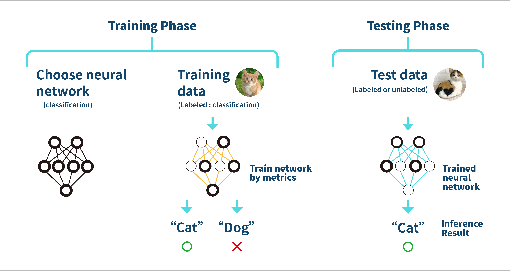
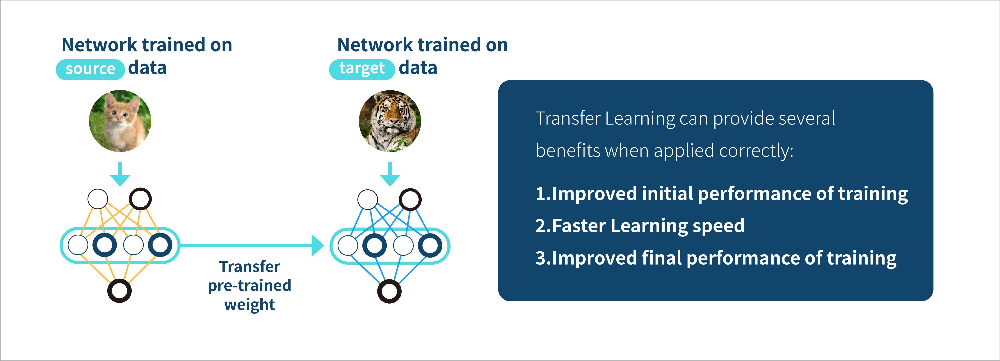

# 1.1 What is Deep Learning?

## Deep Learning and its application in image analysis

"Deep learning is part of a broader family of machine learning methods based on artificial neural networks with representation learning. Learning can be supervised, semi-supervised or unsupervised" -- **Wikipedia**

 (1).png>)

Deep learning uses multiple layers to progressively extract higher level features from the raw input, achieving great breakthroughs in certain applications, especially in image analysis.

.png>)

## Two-phases of Deep Learning model training

\~[https://en.wikipedia.org/wiki/Training,\_validation,\_and\_test\_sets](https://en.wikipedia.org/wiki/Training,\_validation,\_and\_test\_sets)\~

In machine learning, the model is initially fit on a **training data set**, which is a set of examples used to fit the parameters of the model. The model is trained on the training data set using a supervised learning method, for example using optimization methods such as gradient descent or stochastic gradient descent. The current model is run with the training data set and produces a result, which is then compared to the training data set. Based on the result of the comparison and the specific learning algorithm being used, the parameters of the model are adjusted.

Finally, the **test data set** is a data set used to provide an unbiased evaluation of a _final_ model fit on the training data set.If the data in the test data set has never been used in training.

## What is Transfer Learning?

\~[https://en.wikipedia.org/wiki/Transfer\_learning](https://en.wikipedia.org/wiki/Transfer\_learning)\~

**Transfer learning (TL)** is a research problem in machine learning (ML) that focuses on storing knowledge gained while solving one problem (source) and applying it to a different but related problem (target). For example, knowledge gained while learning to recognize cats (source) could apply when trying to recognize tigers (target).

\
