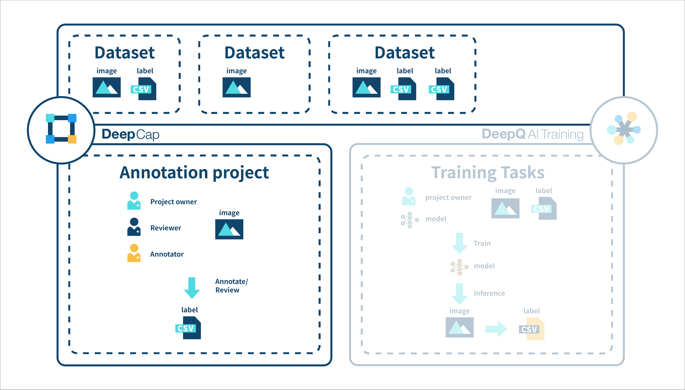

# 3. DeepCap \(Annotation tool\)

## Project List

In the “Project” tab, you can view the annotation status of all the projects that you have created.

**PUBLICATION DATE:** Sort your projects by using the “Publication Date” and “Last Modified”.

\*\*\*\***STATUS:** Filter your projects by using the project status: “On going”, "Finished" and “Stopped”.

\*\*\*\* **SEARCH**: Search your projects using project name.

