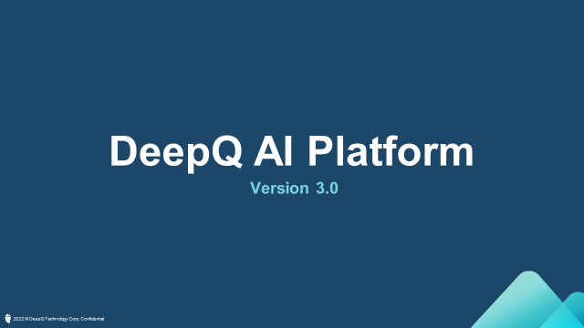

# Advanced functions

##

**Propagate labels**

When annotating serial images such as CT or MRI, the user might want to duplicate labels for continuous slices such as the example shown below. Instead of clicking through each slice, “propagate label” function allows users to label multiple slices with ease.

.png>)

“propagate label” will significantly reduce the effort needed to label continuous slices with the same label

.png>)

In the annotation viewer, “propagate label” will automatically show up if the job is annotating continuous slices.

 (1).png>)

By clicking on “propagate labels”, the user is able to choose which slices will be tagged with the same label, and the type of label that will be assigned to these slices. For detection and segmentation, the user can simply assign “nothing to label” where the object does not exist. User can also exclude continuous slices in the same way by toggling “Exclude image”

.png>)

After assigning specific slices with the same label, the slice indicator below will show that the slices have been labeled (colored segments, representing labeled slices).

### Combine labels

In image classification tasks, although the idea of training a single algorithm to identify numerous classes is appealing, splitting training data among these classes might result in less data per class and eventually causing the neural network unable to learn from the data successfully, thus poor performance.

.png>)

Splitting data among more classes causes less data per class, reducing the effective data size for the neural network to learn from.

.png>)

During annotation project export, user can choose to export directly from the labels or to combine labels into new ones.

.png>)

Click “add a combination” after toggling on the combine label function. User may choose how to combine the classes and assign new class names.



After combining labels, remember to toggle off the existing labels to prevent the new label to become a multi-label annotation (A single image belongs more than one class, “A1” & “Group A” in this case).

.png>)

The combined labels will appear in the new annotation data.

###

**Convert labels**

```
      It happens when a user wants to train a classification AI with object detection annotation data. In order to do so, the labels have to be converted into classification for the algorithms to learn from. DeepQ AI platform provides an easy way for users to convert their label type and try out different applications with the same annotation data.
```

.png>)

```
      During export annotation, choose the annotation type \(target\) you want, DeepQ AI platform will automatically find out & show the available labels \(source\) to convert from. The target-source conversion table is listed below.
```

.png>)

.png>)

Both detection (object 1) & segmentation (object 2) labels can be converted into classification labels. The new classification label will be names as “object 1” & “object 2”

.png>)

Only segmentation labels (object 2) can be converted into detection labels, the label name and number of objects will remain the same after conversion.
