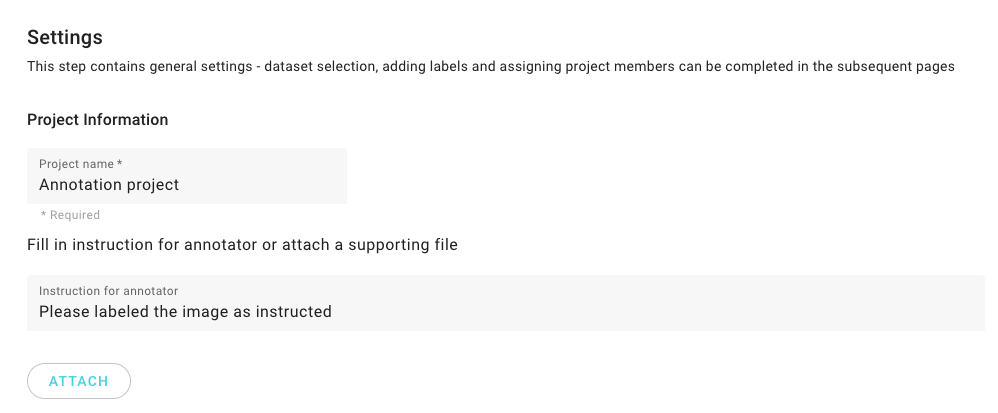
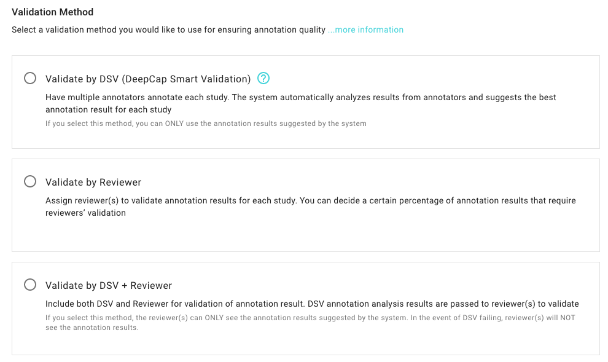

# 1. Settings

## Create Project

\*\*\*\***CREATE PROJECT:** Click on this button and start the project settings. 

## Settings

* Interface overview 

* Input project name and related instruction. 

* Choose one of the validation method from the below options.

* Schedule the project progress \(optional\).

