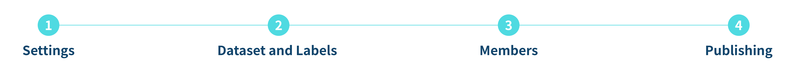
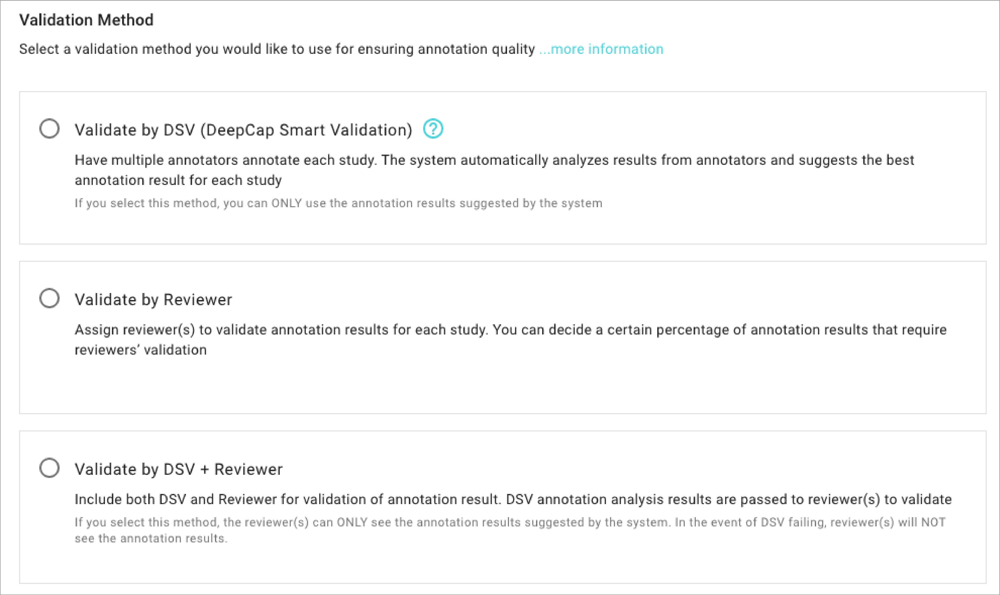
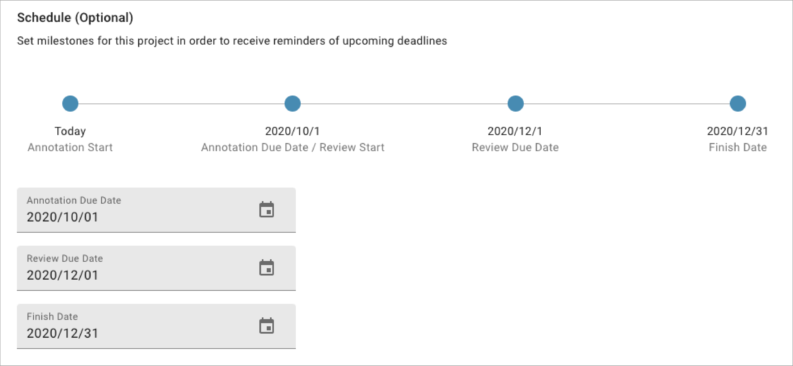

# 1. Settings

## Settings

Input project information, instruction files, set validation method & project schedule (optional)

**Input project name and related instruction.**

* Other than written instructions, project owner can attach additional reference files (jpg, png & pdf)

**Select validation method：**

Choose one of the validation method from the below options. For the detailed explanation of DSV, please refer to [Annotation Quality Control. ](https://app.gitbook.com/s/-LRpbrznmSNshCiwmSTG-3251841457/working-flow/create-an-annotation-project/1.-settings/deepcap-smart-validation-dsv)

**Schedule the project progress (optional).**

