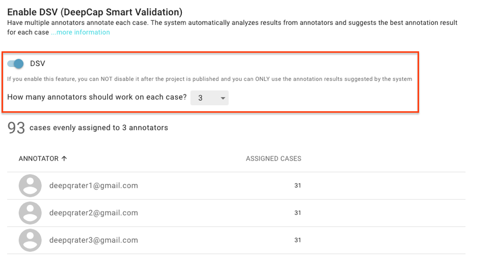

# Annotation Quality Control-finalized

DeepCap Smart Validation provides a consistent rate based on DeepQ original algorithm for an iterative annotation process. The system suggests annotations and provides accurate ground truths for model training.

## Enable DeepCap Smart Validation \(DSV\)

Cases from the dataset are automatically distributed to the annotators. To prepare qualified data for training, the DeepCap Smart Validation \(DSV\) function can be enabled if the number of annotators in this project is greater than or equal to two. For example, if the project contains three annotators, two or three annotators can be selected to work on each study.  The maximum number of annotators that can be assigned to work on each case is five. The DSV function provides a consistent rate based on the DeepQ original algorithm for an iterative annotation process. DeepCap DSV suggests accurate ground truths for model training. 

### **Notice:**

* The number of annotators to work on each case cannot be edited once the project is published. 
* The DSV result is applied as the default value to export for training. 
* You can return each case to the annotator or exclude it from artificial intelligence \(AI\) training if the DSV result is not acceptable to your requirements.

## View DSV result from Annotation Details

As a project owner, you can view the DSV result suggested for each image and can check annotation results from each annotator. 

#### Image Classification:

* **DSV result:** The suggested label and the consistency rate are shown in this section. The DSV calculation for image classification is simple as the DSV result is determined by estimating the majority consensus. For example, if there were three annotators work on each image, two of them select the same label for one image, the consistency rate would be 67%. The DSV result is presented as “failed” if the consistency rate is less than or equal to 50%. In this case, you can return \(\) this case to the annotator or exclude \(\) this case from AI training. 

#### Object Detection:

* **DSV result:** The suggested bounding box and consistency rate ****will ****be presented in this area. You can hide the DSV bounding box ****label by clicking “”. The DSV result for object detection is based on the following calculation steps.

1. Calculate IoU for each bounding box from different annotator.
2. Grouping the bounding boxes. 
3. Calculate the average of the bounding box groups.

**\[Disable annotator result\]**   

**\[Enable annotator result\]**

* **Annotator result:** You can enable “annotator result” to view all bounding boxes annotated by each annotator on the image. The remaining bounding boxes will be presented on the image.

