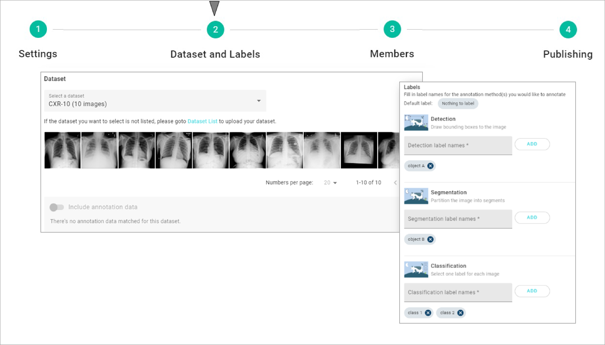

# 2. Dataset & Labels

## Select Dataset

* Select one of the datasets that have been uploaded from the drop list.
* Case preview will be shown below to help you ensure that you select the correct dataset.
* You can choose to include the annotation data.

## Label Setting

* Chose one or more label types that you want to add on the dataset.
* Define the label names for each label type.

### Task definition

* **Image Classification:** One or multiple label can be marked on a case.
* **Object Detection:** Use bounding box to detect and identify target objects.
* **Object Segmentation:** To segment and define the ROI (range of interest).
