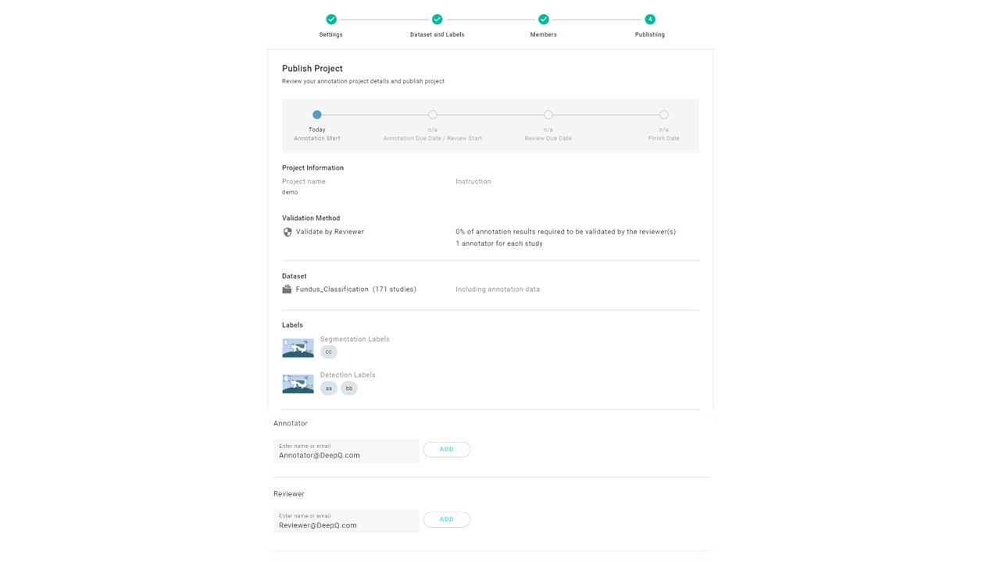

# 4. Publishing

## Publish Project

The annotation project can be published after the preview process from previous step. All the participated annotators would receive an invitation mail, and the annotation process is initiated.

