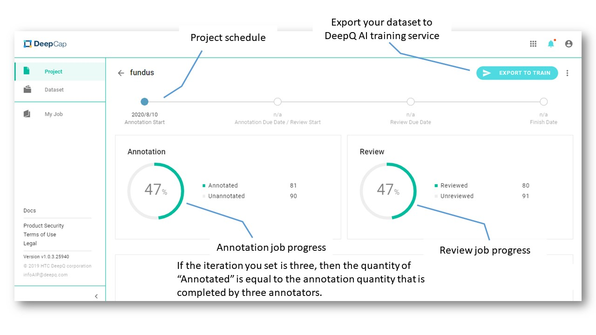
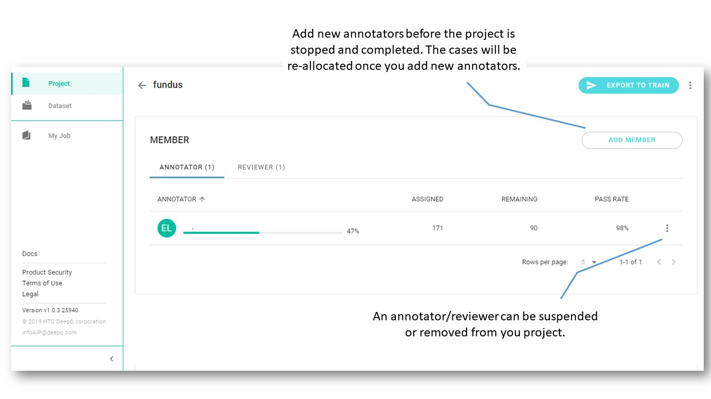
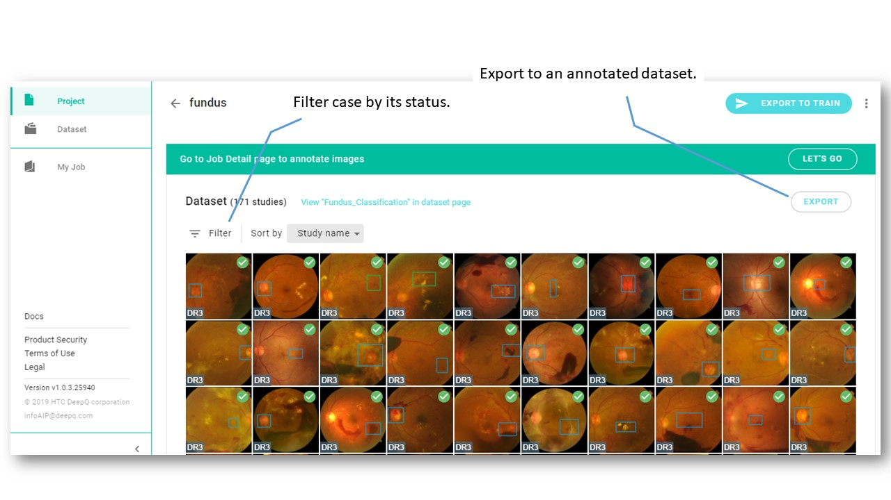
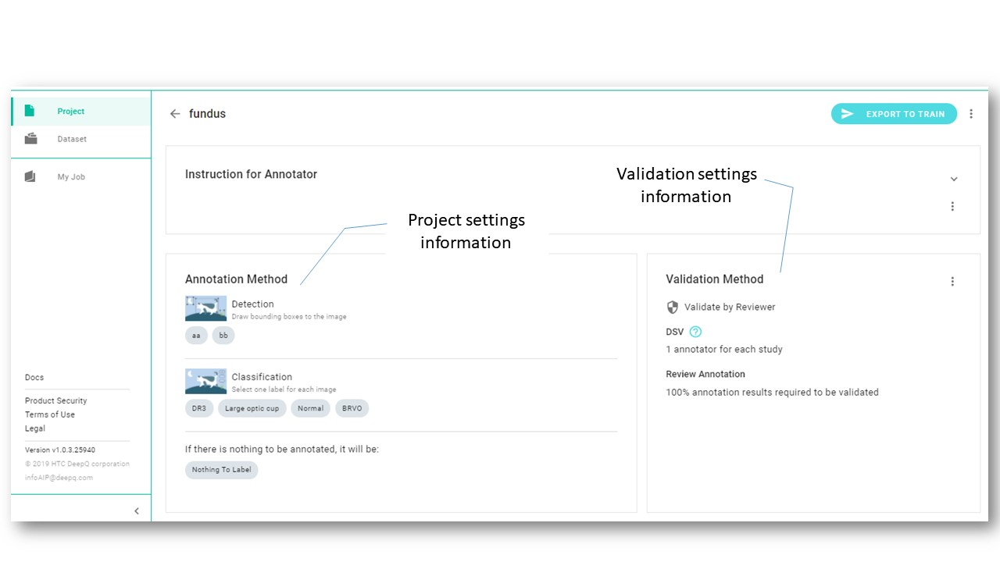

# Manage Annotation Projects-finalized

## View Details 

* _**Suspend:** An annotator’s job will be released when they are suspended from the project. The suspended status can be resumed._ 
* _**Remove:** An annotator’s job will be released when they are removed from the project. A removed annotator cannot be added again once removed by a project owner._

* _**Sort by:** Study name, Last finished, Lowest DSV: classification, Lowest DSV: segmentation, Lowest DSV: detection, depends on the project type._

## Export Annotated Dataset for Training

Dataset that cannot be exported for training.

* Without annotation result: There is no any saved annotations for this dataset. 
* User exclude: A project Owner excludes \(\) that case. 
* System exclude: The DSV result excludes that case because of an unacceptably lower consistency rate. 
* Problematic image: Annotated as “Problematic image” by an annotator. 

## Annotation Conditions for Training

To deliver the best possible training performance, please ensure that your annotation meets our system requirements.

*   **Image Classification**:

The annotated dataset should contain at least two categories and each category should be used as an annotation on at least two cases. For example: Class“A” was used on case 001 and case 002, and Class“B” was used on case 003 and case 004.

| Dataset | Annotation |
| :--- | :--- |
| Case 001 | A |
| Case 002 | A |
| Case 003 | B |
| Case 004 | B |

*  **Object Detection**

The annotated dataset must contain at least three cases, and each case should be annotated with at least one bounding box.   
For example, Cases 001, 002, and 003 should be annotated with at least One bounding box.

| Dataset | Annotation |
| :--- | :--- |
| Case 001 | Bounding Box with Tag “A” |
| Case 002 | Bounding Box with Tag “A” |
| Case 003 | Bounding Box with Tag “B” |

