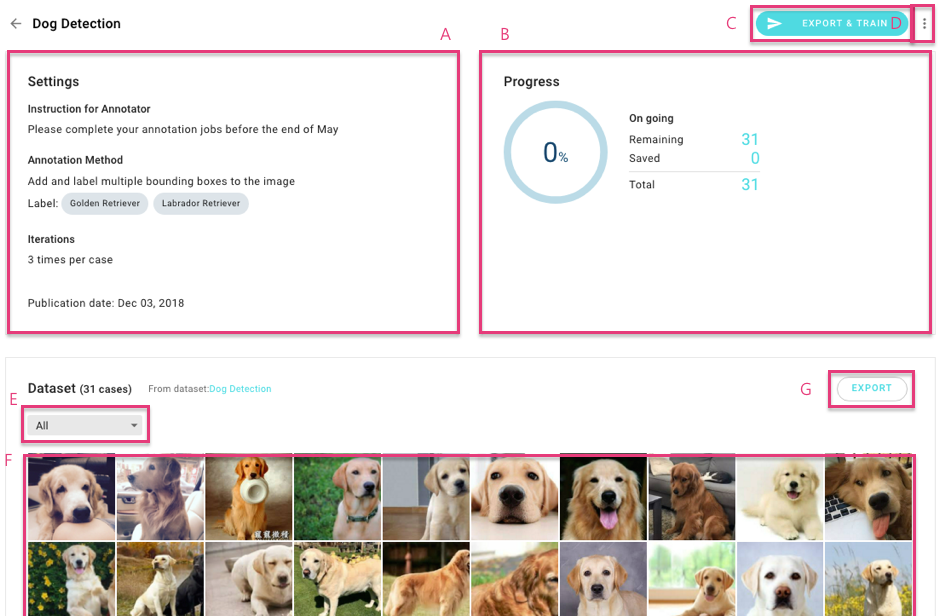
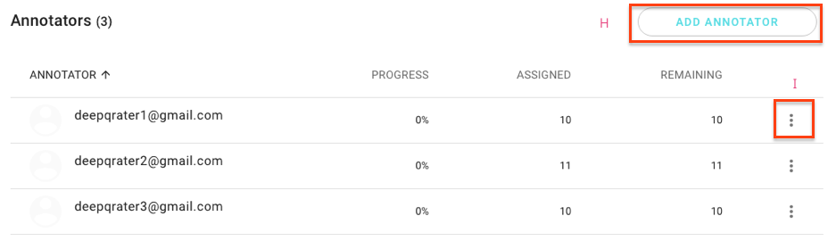

# Manage Annotation Projects \(換圖\)

## View Details 

Click on “VIEW DETAILS” to check annotation details of each project that you published. 

**A:** Project settings information 

**B:** You can monitor the annotation progress of your project. If the iteration you set is three, then the quantity of “saved cases” is equal to the annotation quantity that is completed by three annotators. 

**C:** Export your dataset to DeepQ AI training service in one click. 

**D:** Use the “Edit project name”, “Edit instruction for annotator”, “Stop project” and “Delete  
project” functions as required from the menu button. 

**E:** Filter cases based on the annotation status.

| Annotation Status |  |
| :--- | :--- |
| Remaining     | These cases have not been annotated by all assigned annotators.  |
| Saved  | These cases have been annotated and saved by all assigned annotators.  |
| Returned | 
These cases have been returned to one of the assigned annotators. |
| Revised | These cases have received all the requested revisions.  |
| Excluded | These cases have been manually set to exclude from export.  |
| DSV failed | These cases did not pass the consistency standard. |

**F:** Click on each thumbnail image to annotate. “Saved” cases might be indicated using a  
“green tick”. Thus, you can also view the annotation status on this preview mode. 

**G:** Export to an annotated dataset. 

**H:** You can add new annotators before the project is stopped and completed. The cases will be re-allocated once you add new annotators. 

**I:** An annotator can be suspended and removed from you project.

* **Suspend:** An annotator’s job will be released when they are suspended from the project. The suspended status can be resumed. 
* **Remove:** An annotator’s job will be released when they are removed from the project. A removed annotator cannot be added again once removed by a project owner.

Click on one of the cases to view the annotation status. You can return \( \) this case to an annotator or exclude \(\) this case from AI training if the annotation result is not qualified based on your consideration.

## Export Annotated Dataset for Training

Dataset that cannot be exported for training.

* Without annotation result: There is no any saved annotations for this dataset. 
* User exclude: A project Owner excludes \(\) that case. 
* System exclude: The DSV result excludes that case because of an unacceptably lower consistency rate. 
* Problematic image: Annotated as “Problematic image” by an annotator. 

## Annotation Conditions for Training

To deliver the best possible training performance, please ensure that your annotation meets our system requirements.

*   **Image Classification**:

The annotated dataset should contain at least two categories and each category should be used as an annotation on at least two cases. For example: Category “Dog” was used on cases A and B, and category “Cat” was used on cases C and D.

| Dataset | Annotation |
| :--- | :--- |
| Case A | Dog |
| Case B | Dog |
| Case C | Cat |
| Case D | Cat |

*  **Object Detection**

The annotated dataset must contain at least three cases, and each case should be annotated with at least one bounding box. **\(描述看不懂\)**  
For example, Cases A, B, and C should be annotated with at least One bounding box.

| Dataset | Annotation |
| :--- | :--- |
| Case A | Bounding Box with Tag “Dog” |
| Case B | Bounding Box with Tag “Dog” |
| Case C | Bounding Box with Tag “Cat” |

