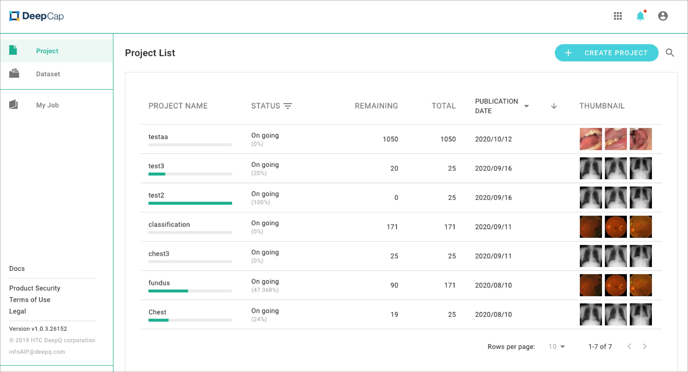
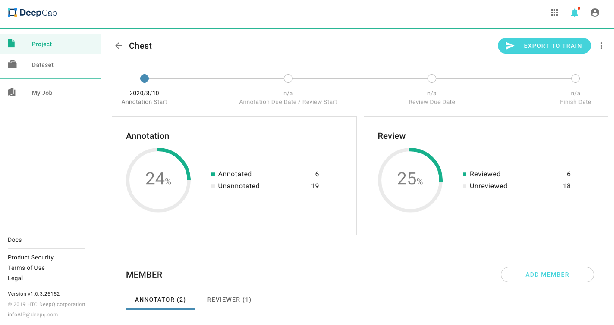
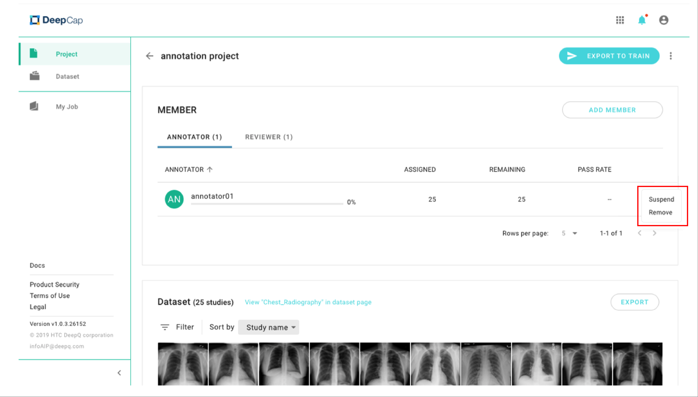
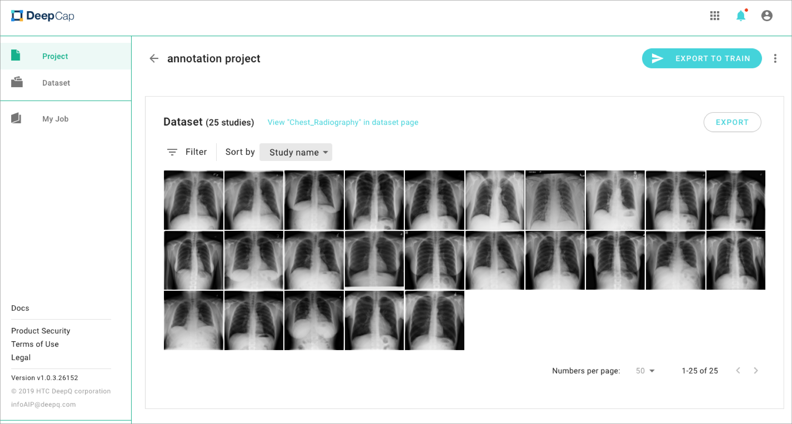

# 3.3 Manage Annotation Projects

Once an annotation project has been published and running, the project owner can view and manage the project anytime.

## View Details

* **Project schedule:** The summary of project schedule is shown here to help the project owner review the progress.
* **Annotation progress:** If the iteration you set is three, then the quantity of "Annotated" is equal to the annotation quantity that is completed by three annotators.
* **Review progress:** This column shows the review progress that has completed by the reviewer.
* **Export to training:** You can directly export the annotated data to DeepQ AI Training service by clicking on the bottom.

* You can add new annotators before the project is stopped and completed. The cases will be re-allocated once you add new annotators.
* An annotator/ reviewer can be suspended or removed from the project.
  * **Suspend:** An annotator’s job will be released when they are suspended from the project. The suspended status can be resumed.
  * **Remove:** An annotator’s job will be released when they are removed from the project. A removed annotator cannot be added again once removed by a project owner.

* **Filter | Sort by:** Study name, Last finished, Lowest DSV: classification, Lowest DSV: segmentation, Lowest DSV: detection, depends on the project type.
* **Export:** You can also export the annotated data to DeepQ AI Training service directly.

## Export Annotated Dataset for Training

Dataset that cannot be exported for training.

* Without annotation result: There is no any saved annotations for this dataset.
* User exclude: A project Owner excludes () that case.
* System exclude: The DSV result excludes that case because of an unacceptably lower consistency rate.
* Problematic image: Annotated as “Problematic image” by an annotator.
* <mark style="color:red;">**The minimum annotation requirement for each class is 3 images. If the annotation contains class(es) with less than 3 images, it cannot be exported.**</mark>

## Annotation requirements for Training

To deliver the best possible training performance, please ensure that your annotation meets our system requirements.

* **Image Classification**:

The annotated dataset should contain at **least two categories** and each category should be used as an annotation on at least **three images**. For example: Class“A” was used on image 001, 002 & 005, and Class“B” was used on image 003, 004 & 006.

| Dataset   | Annotation |
| --------- | ---------- |
| Image 001 | A          |
| Image 002 | A          |
| Image 003 | B          |
| Image 004 | B          |
| Image 005 | A          |
| Image 006 | B          |

* **Object Detection/segmentation**

The annotated dataset must contain at least three images, and each case should be annotated with at least one bounding box/object or "nothing to label".\
For example, Image 001, 002, and 005 were annotated with at least One bounding box/object.

| Dataset   | Annotation                       |
| --------- | -------------------------------- |
| Image 001 | Bounding Box/object : “ Class A” |
| Image 002 | Bounding Box/object： Class “A”   |
| Image 003 | nothing to label                 |
| Image 004 | nothing to label                 |
| Image 005 | Bounding Box/object： Class “A”   |
| Image 006 | nothing to label                 |
