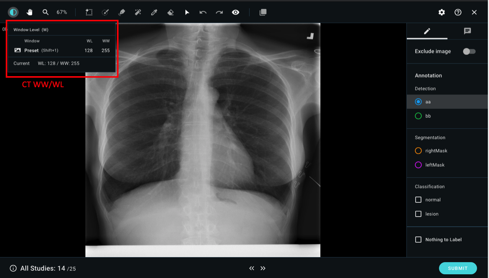

# 3.2 Start Annotation

## My Job--Job List

Click on the "My Job" tab, you can view the job list that was assigned by the project owner. The total cases that have been assigned to you and the cases that have not been annotated is shown in each job. Click on "**ANNOTATE**" or "**REVIEW**"and begin the annotation process.

## Annotation Job--Detail Page

All information an annotator needs to know is shown in the annotation job detail page, from annotation progress in terms of # of jobs left & completion percentage, method & labels and the project owners instructions.&#x20;

Scroll down to check the image studies assinged to you. Studies that have been annotated and subitted will have a green check mark on its thumbnail. You may select any study to start annotating, or simply click on "**ANNOTATE**" to start from the first unsubmitted study.

| Column Name       | Description                                                                      |
| ----------------- | -------------------------------------------------------------------------------- |
| My annotation job | Cases that have not been annotated.                                              |
| Progress          | The completion percentage of this project.                                       |
| Annotation Method | Annotation Method setting information.                                           |
| Study             | All the cases will be shown here, you can choose whichever you want to annotate. |

You can filter the studies by annotation status: Remaining, Finished, Returned.

## Image Annotation

### Annotation view instructions:

* Choose the annotation labels from the right column to add on the image.
* You can select one of the labels for the entire case. If there are no labels can be annotated, please select “Nothing to Label”.

* You can view the WW/WL of that image by the top left button, select it to adjust the WW/WL of the image.
* Click on .svg>) _\*\*_ and slide to zoom in and zoom out the images.

.png>)

* The annotator may also leave image-level or object-level comments in the annotation viewer. the comments will be passed down to the reviewer/project owner and will be recorded in the annotation project detail.

#### After labeling the case:

Click on “**SUBMIT**” after annotating each case. You can also click on “<<” to go back to the last case or click on “>>” to go to the next page without submission.

#### Notice:

* Once the case is submitted, the label cannot be changed unless returned by reviewer
*   For larger images (>1000 both side), it may take some time to process complex annotation (e.g. segmentation), therefore it takes a while to reflect the changes after submit.

    ####

## Review job -- Detail Page

Once you click on the review job assigned to you, the ncessary review job information can be found in this overview page:  review progress in terms of # of jobs left & completion percentage, method & labels and the project owners instructions and all review jobs and their respective status listed below.&#x20;

.png>)

All assigned studies that have been annotated/submitted by annoatators and waiting to be reviewed will appear on the list at the bottom.&#x20;

.png>)

##

## Annotation Review

.png>)

* **Pass**：The annotation result meets the standard of the project and can be sent to training
* **Fail**：The annotation or image does not qualify and therefore should be excluded and cannot be used to train models.

Make sure to click on "**SUBMIT**" button to send out your review results

* **Return**：The annotation is sent back to the annotator with comments attached.

Comments can also be left as it is done in the annotation process.
