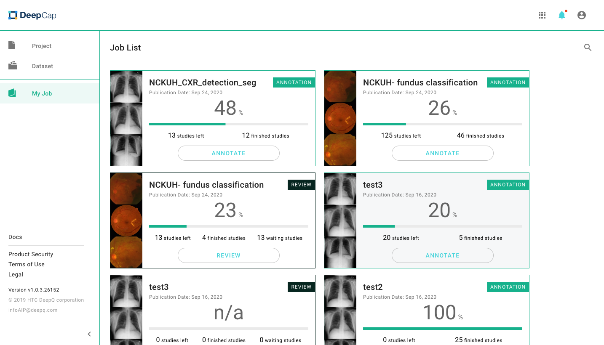
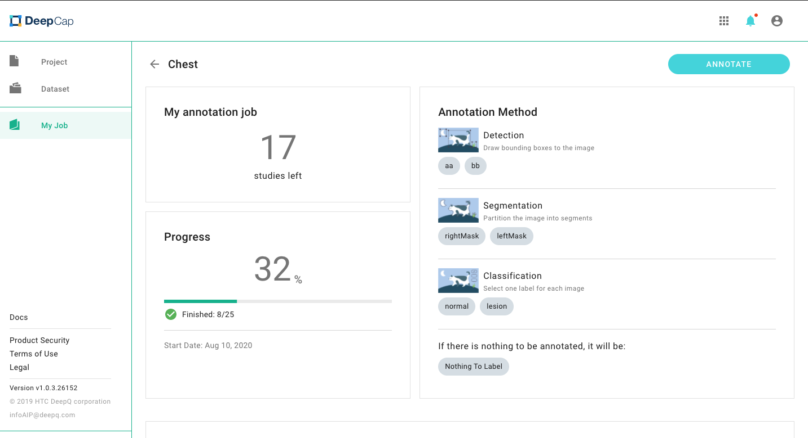
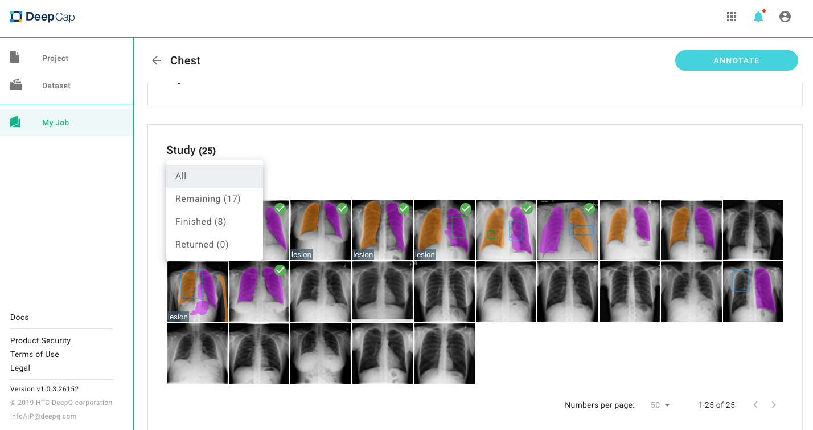
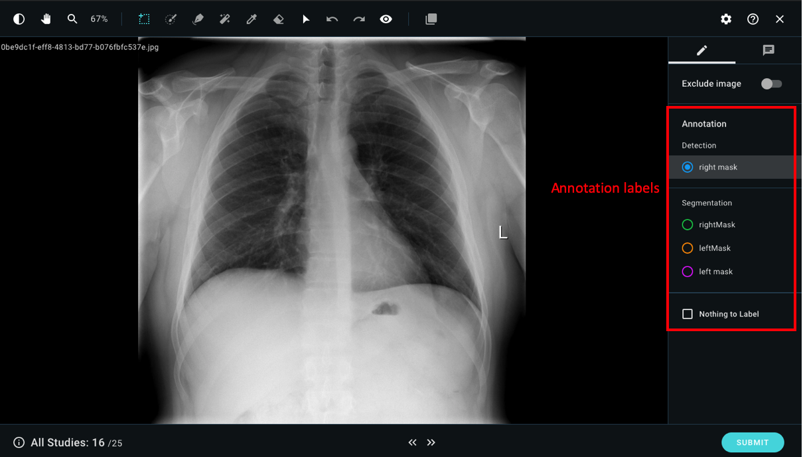

# Start Annotation \(補icon\)

Click on the "My Job" tab,  you can view the job list that was assigned by the project owner. The total cases that have been assigned to you and the cases that have not been annotated is shown in each job. Click on "ANNOTATE" and begin the annotation process. 

## Detail Page

| Column Name  | Description |
| :--- | :--- |
| My annotation job | Cases that have not been annotated.  |
| Progress | The completion percentage of this project. |
| Annotation Method  | Annotation Method setting information. |
| Study | All the cases will be shown here, you can choose whichever you want to annotate.  |

You can filter the studies by annotation status: Remaining, Finished, Returned. 

## Image Annotation

### Annotation view instructions: 

* Choose the annotation labels from the right column to add on the image.
* You can select one of the labels for the entire case. If there are no labels can be annotated, please select “Nothing to Label”. 

* You can view the WW/WL of that image by the top left button, select it to adjust the WW/WL of the image. 
* Click **\(放大鏡icon\)** and slide to zoom in and zoom out the images. 

#### After labeling the case: 

Click on “SUBMIT” after annotating each case. You can also click on “&lt;&lt;” to go back to the last case or click on “&gt;&gt;” to go to the next page without submission.

#### Notice: 

Once the case is submitted, the label cannot be changed.

