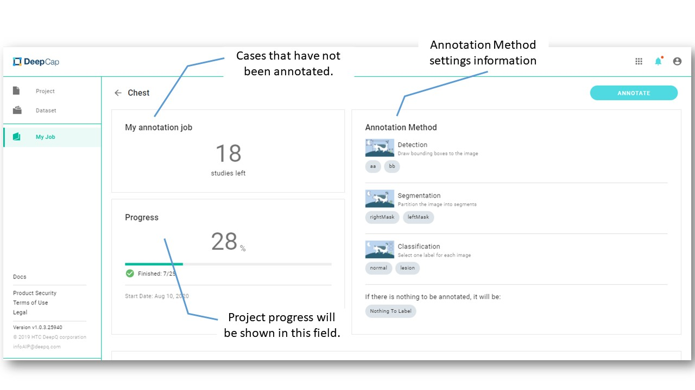
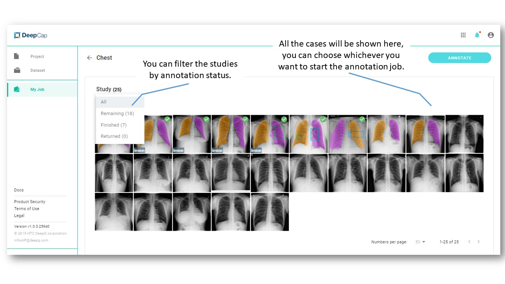
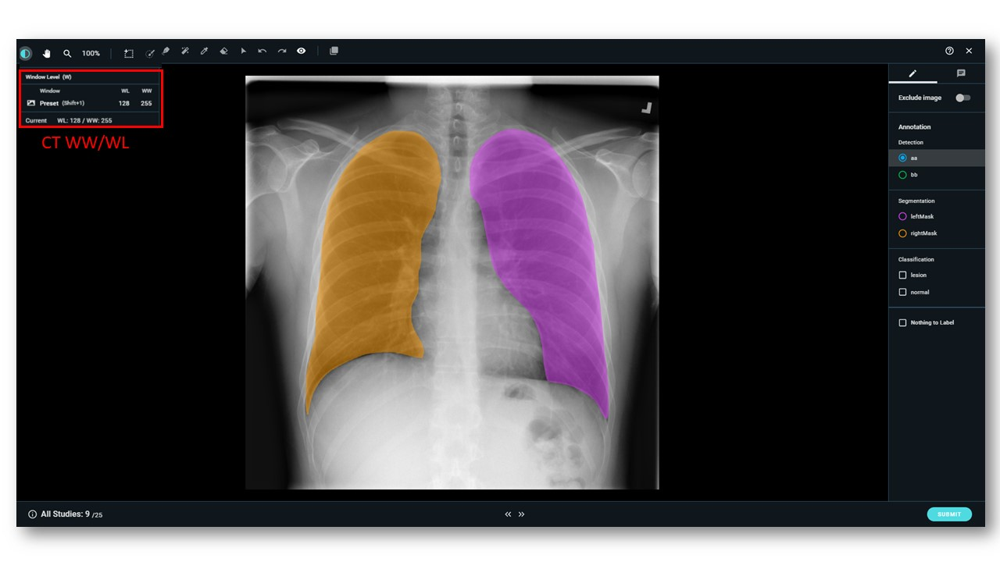
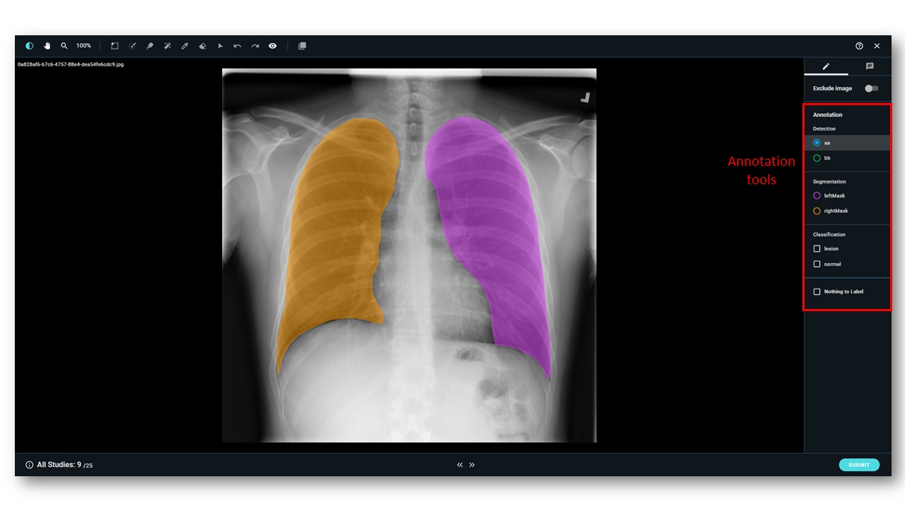

# Start Annotation

Click on the "My Job" tab,  you can view the job list that was assigned by the project owner. The total cases that have been assigned to you and the cases that have not been annotated is shown in each job. Click on "ANNOTATE" and begin the annotation process. 

## Detail Page

## Image Annotation--Classification

Annotation view instructions: 

* You can select one of the labels for the entire case. If there are no labels can be annotated, please select “Nothing to Label”.  
* Please click on “SUBMIT” after annotating each case. You can also click on “&lt;&lt;” to go back to the last case or click on “&gt;&gt;” to go to the next page.
* Click  and slide to zoom in and zoom out the images. 

## Image Annotation--Object Detection 

* You can view the WW/WL of that image by the top left button.
* Select the top left button to adjust the WW/WL of the image. 

* Choose the annotation tool from the right column to label on the image. 

