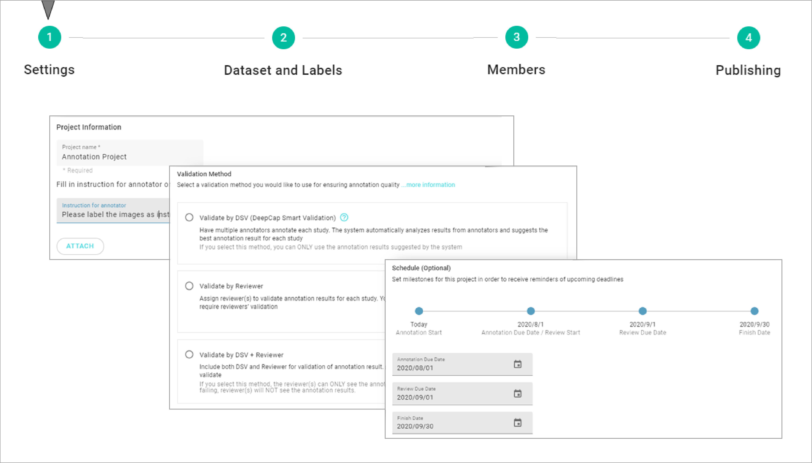
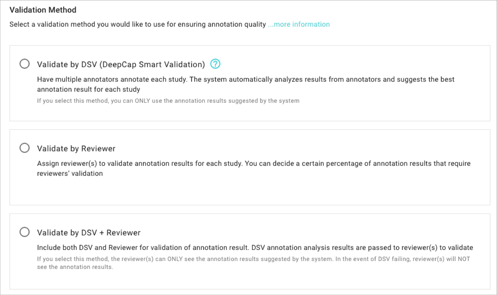
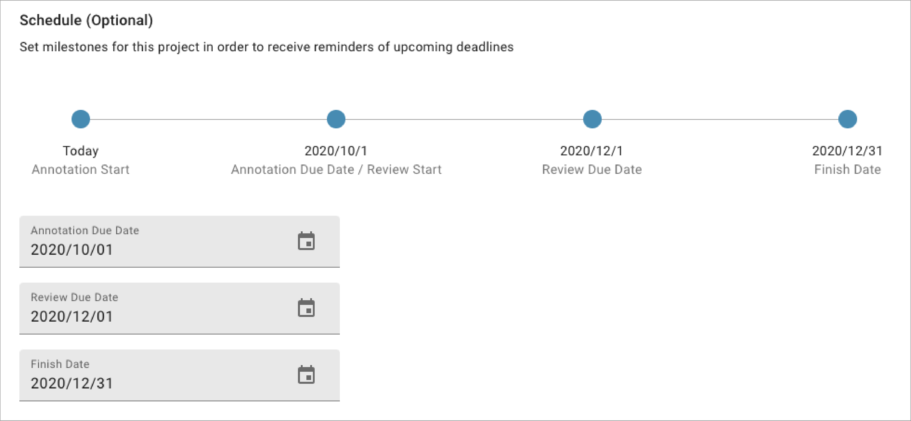

# 1. Settings

## Create Project

\*\*\*\***CREATE PROJECT:** Click on this button and start the project settings.

## Settings

* **Interface overview** 

* **Input project name and related instruction.** 

* **Choose one of the validation method from the below options. For the detailed explanation of DSV, please refer to** [**Annotation Quality Control.** ](https://app.gitbook.com/@deepq/s/aip/~/drafts/-MLQW5Rc6CLE9mln1sRi/working-flow/create-an-annotation-project/1.-settings/deepcap-smart-validation-dsv)\*\*\*\*

* **Schedule the project progress \(optional\).**

